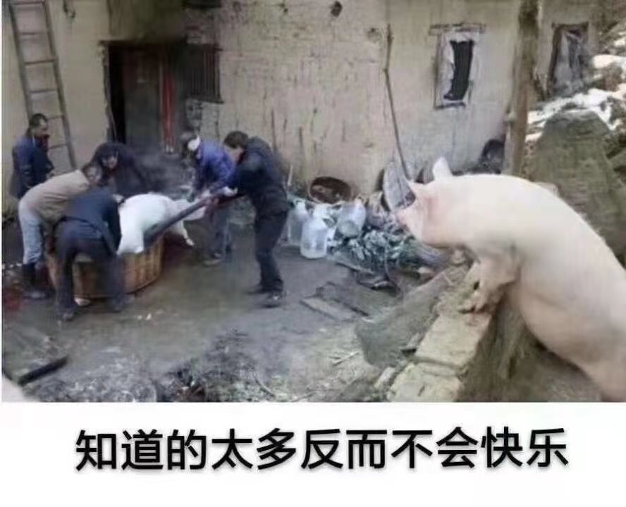

<!-- ### 用心写代码，不辜负程序员之名 -->
  
  <!-- 我是小陈 -->

  <!-- #####         本着三天打渔，两天晒网的学习精神，之前的笔记记的很零散，为知笔记，github，手机备忘录，甚至A4纸上也有记录过，时间一久，写哪自己都忘了。所以搭建一个自己的站点（现成的框架，按文档来即可）。不用在去充会员，登账号密码，便于自己记录，复习。佛系更新法，内容包含但不限于自己对前端的一些认识、知识点、面试题，想起什么更什么... -->
   <!--  -->
  <!-- 

     
  
 -->
   
  ##### 平时开发记录
  ##### 前端方面计划的学习路径：js基础，js进阶，ts，工程搭建，vue和react源码分析，node。
  ##### 进展跟随目录菜单更新（2020.5.28）
  ##### 文章采用markdown格式书写，所有源码都放在github仓库中
  ##### vuePress-theme-home  valine 评论功能
    
**快速跳转**

>+ #### [JavaScript 函数式编程](components/page/funPro.md)
>+ #### [JavaScript es6](components/page/ES6.md)
>+ #### [typeScript](components/ts)
>+ #### [前端工程化](components/engineering)
>+ #### [面试题](components/question/proAndAsync.md)
>+ ##### [随笔](components/gnosis)

  

     <!--  -->
  

<!-- ###### 一切的瞎折腾，只为一个大厂梦，兴许那天就实现了呢 -->
###### Don`t repeat yourself.
###### wx: bootstet
<!-- ###### 另外也为了不必去低声附和那些看不惯你和你看不惯的人 -->
