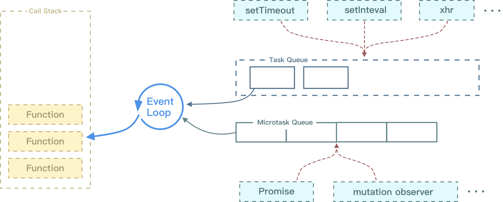

## 一、进程与线程

### 1、进程与线程的概念
从本质上说，进程与线程都是CPU工作时间片的一个描述：
+ 进程描述了 CPU 在运行指令及加载和保存上下文所需的时间，放在应用上说就代表了一个程序。
+ 线程是进程中的更小单位，描述了执行一段指令所需的时间。
 **进程是资源分配的最小单位，线程是CPU调度的最小单位**

一个进程就是一个程序的运行实例。详细解释就是，启动一个程序的时候，操作系统会为该程序创建一块内存，用来存放代码、运行中的数据和一个执行任务的主线程，我们把这样一个运行环境叫**进程**。**进程是运行在虚拟内存上的，虚拟内存是用来解决用户对硬件资源的无线需求和有限的硬件资源之间的矛盾的。从操作系统角度来看，虚拟内存即交换文件；从处理器角度看，虚拟内存即虚拟地址空间。**

如果程序很多时，内存可能会不够，操作系统为每个进程提供一套独立的虚拟地址空间，从而使得同一块物理内存在不同的进程中可以对应到不同或相同的虚拟地址，变相的增加了程序可以使用的内存。


进程和线程之间的关系有以下四个特点：
+ 进程中的任意一线程执行出错，都会导致整个进程的崩溃。
+ 线程之间共享进程中的数据。
+ **当一个进程关闭之后，操作系统会回收进程所占用的内存**，当一个进程退出时，操作系统会回收该进程所申请的所有资源；即使其中任意线程因为操作不当导致内存泄漏，当进程退出时，这些内存也会被正确回收。
+ **进程之间的内容相互隔离**。进程隔离就是为了使操作系统中的进程互不干扰，每一个进程只能访问自己占有的数据，也就避免出现进程 A 写入数据到进程 B 的情况。正是因为进程之间的数据是严格隔离的，所以一个进程如果崩溃了，或者挂起了，是不会影响到其他进程的。如果进程之间需要进行数据的通信，这时候，就需要使用用于进程间通信的机制了。

进程可能包括主控进程，插件进程，GPU，tab页（浏览器内核）等等。
+ **Browser进程**：浏览器的主进程（负责协调、主控），只有一个。主要负责界面显示、用户交互、子进程管理，同时提供存储等功能。
+ **第三方插件进程**：每种类型的插件对应一个进程，仅当使用该插件时才创建。主要是负责插件的运行，因插件易崩溃，所以需要通过插件进程来隔离，以保证插件进程崩溃不会对浏览器和页面造成影响。
+ **GPU进程：**最多一个，用于3D绘制。其实， GPU 的使用初衷是为了实现 3D CSS 的效果，只是随后网页、Chrome 的 UI 界面都选择采用 GPU 来绘制，这使得 GPU 成为浏览器普遍的需求。最后，Chrome 在其多进程架构上也引入了 GPU 进程。

+ **浏览器渲染进程（内核）：**默认每个Tab页面一个进程，互不影响，控制页面渲染，脚本执行，事件处理等（有时候会优化，如多个空白tab会合并成一个进程）。核心任务是将 HTML、CSS 和 JavaScript 转换为用户可以与之交互的网页，排版引擎 Blink 和 JavaScript 引擎 V8 都是运行在该进程中，默认情况下，Chrome 会为每个 Tab 标签创建一个渲染进程。出于安全考虑，渲染进程都是运行在沙箱模式下。
+ **网络进程**：主要负责页面的网络资源加载，之前是作为一个模块运行在浏览器进程里面的，直至最近才独立出来，成为一个单独的进程。
如下图：

### 2、进程和线程的区别
+ 进程可以看做独立应用，线程不能
+ 资源：进程是cpu资源分配的最小单位（是能拥有资源和独立运行的最小单位）；线程是cpu调度的最小单位（线程是建立在进程的基础上的一次程序运行单位，一个进程中可以有多个线程）。
+ 通信方面：线程间可以通过直接共享同一进程中的资源，而进程通信需要借助 进程间通信。
+ 调度：进程切换比线程切换的开销要大。线程是CPU调度的基本单位，线程的切换不会引起进程切换，但某个进程中的线程切换到另一个进程中的线程时，会引起进程切换。
+ 系统开销：由于创建或撤销进程时，系统都要为之分配或回收资源，如内存、I/O 等，其开销远大于创建或撤销线程时的开销。同理，在进行进程切换时，涉及当前执行进程 CPU 环境还有各种各样状态的保存及新调度进程状态的设置，而线程切换时只需保存和设置少量寄存器内容，开销较小。

### 3、浏览器渲染进程的线程有哪些
每一个tab页面可以看作是浏览器内核进程（渲染进程），然后这个进程是多线程的，它有几大类子线程

+ GUI 渲染线程
  负责渲染浏览器页面、解析HTML、CSS、构建DOM树、构建CSSOM树、构建渲染树和绘制页面；当页面需要**重绘**或由于某种操作引发**回流**时，该线程就会执行。
  注意：GUI渲染线程和JS引擎线程是互斥的，当JS引擎执行时GUI线程会被挂起，GUI更新会被保存在一个队列中等到JS引擎空闲时立即被执行。
+ JS引擎线程
  JS引擎线程也称为JS内核，负责处理Javascript脚本程序，解析JAvascript脚本，运行代码；JS引擎线程一直等待着任务队列中任务的到来，然后加以处理，一个Tab页中无论什么时候都只有一个JS引擎线程在运行JS程序；
  注意：GUI渲染线程与JS引擎线程的互斥关系，所以如果JS执行的时间过长，会造成页面的渲染不连贯，导致页面渲染加载阻塞。
+ 时间触发线程
  **时间触发线程**属于浏览器而不是JS引擎，用来控制事件循环；当JS引擎执行代码块如setTimeOut时（也可是来自浏览器内核的其他线程,如鼠标点击、AJAX异步请求等），会将对应任务添加到事件触发线程中；当对应的事件符合触发条件被触发时，该线程会把事件添加到待处理队列的队尾，等待JS引擎的处理；

  注意：由于JS的单线程关系，所以这些待处理队列中的事件都得排队等待JS引擎处理（当JS引擎空闲时才会去执行）；
  + 定时器触发进程
  **定时器触发进程**即setInterval与setTimeout所在线程；浏览器定时计数器并不是由JS引擎计数的，因为JS引擎是单线程的，如果处于阻塞线程状态就会影响记计时的准确性；因此使用单独线程来计时并触发定时器，计时完毕后，添加到事件队列中，等待JS引擎空闲后执行，所以定时器中的任务在设定的时间点不一定能够准时执行，定时器只是在指定时间点将任务添加到事件队列中；

  注意：W3C在HTML标准中规定，定时器的定时时间不能小于4ms，如果是小于4ms，则默认为4ms。
+ 异步http请求线程
  - XMLHttpRequest链接后通过浏览器新开一个线程请求；
  - 检测到状态变更时，如果设置有回调函数，异步线程就产生状态变更事件，将回调函数放入事件队列中，等待JS引擎空闲后执行；
### 4、 进程之前的通信方式
+ （1）管道通信
  管道是一种最基本的进程间通信机制。管道就是操作系统在内核中开辟的一段缓冲区，进程1可以将需要交互的数据拷贝到这段缓冲区，进程2就可以读取了。

  管道的特点：
  + 只能单向通信
  + 只能血缘关系的进程进行通信
  + 依赖于文件系统
  + 生命周期随进程
  + 面向字节流的服务
  + 管道内部提供了同步机制
+ （2）消息队列通信
  消息队列就是一个消息的列表。用户可以在消息队列中添加消息、读取消息等。消息队列提供了一种从一个进程向另一个进程发送一个数据块的方法。 每个数据块都被认为含有一个类型，接收进程可以独立地接收含有不同类型的数据结构。可以通过发送消息来避免命名管道的同步和阻塞问题。但是消息队列与命名管道一样，每个数据块都有一个最大长度的限制。

  使用消息队列进行进程间通信，可能会收到数据块最大长度的限制约束等，这也是这种通信方式的缺点。如果频繁的发生进程间的通信行为，那么进程需要频繁地读取队列中的数据到内存，相当于间接地从一个进程拷贝到另一个进程，这需要花费时间。
+ （3）信号量通信
  共享内存最大的问题就是多进程竞争内存的问题，就像类似于线程安全问题。我们可以使用信号量来解决这个问题。信号量的本质就是一个计数器，用来实现进程之间的互斥与同步。例如信号量的初始值是 1，然后 a 进程来访问内存1的时候，我们就把信号量的值设为 0，然后进程b 也要来访问内存1的时候，看到信号量的值为 0 就知道已经有进程在访问内存1了，这个时候进程 b 就会访问不了内存1。所以说，信号量也是进程之间的一种通信方式。
+ （4）信号通信
  信号（Signals ）是Unix系统中使用的最古老的进程间通信的方法之一。操作系统通过信号来通知进程系统中发生了某种预先规定好的事件（一组事件中的一个），它也是用户进程之间通信和同步的一种原始机制。
+ （5）共享内存通信
  共享内存就是映射一段能被其他进程所访问的内存，这段共享内存由一个进程创建，但多个进程都可以访问（使多个进程可以访问同一块内存空间）。共享内存是最快的 IPC 方式，它是针对其他进程间通信方式运行效率低而专门设计的。它往往与其他通信机制，如信号量，配合使用，来实现进程间的同步和通信。
+ （6）套接字通信
上面我们说的共享内存、管道、信号量、消息队列，他们都是多个进程在一台主机之间的通信，那两个相隔几千里的进程能够进行通信吗？答是必须的，这个时候 Socket 这家伙就派上用场了，例如我们平时通过浏览器发起一个 http 请求，然后服务器给你返回对应的数据，这种就是采用 Socket 的通信方式了。
### 5、僵尸进程和孤儿进程是什么？
+ **孤儿进程**：父进程退出了，而它的一个或多个进程还在运行，那这些子进程都会成为孤儿进程。孤儿进程将被init进程(进程号为1)所收养，并由init进程对它们完成状态收集工作。
+ **僵尸进程**：子进程比父进程先结束，而父进程又没有释放子进程占用的资源，那么子进程的进程描述符仍然保存在系统中，这种进程称之为僵死进程。
### 6、如何实现浏览器内多个标签页之间的通信?
实现多个标签页之间的通信，本质上都是通过中介者模式来实现的。因为标签页之间没有办法直接通信，因此我们可以找一个中介者，让标签页和中介者进行通信，然后让这个中介者来进行消息的转发。通信方法如下：
+ **使用 websocket 协议**，因为 websocket 协议可以实现服务器推送，所以服务器就可以用来当做这个中介者。标签页通过向服务器发送数据，然后由服务器向其他标签页推送转发。
+ **使用 ShareWorker 的方式**，shareWorker 会在页面存在的生命周期内创建一个唯一的线程，并且开启多个页面也只会使用同一个线程。这个时候共享线程就可以充当中介者的角色。标签页间通过共享一个线程，然后通过这个共享的线程来实现数据的交换。
+ **使用 localStorage 的方式**，我们可以在一个标签页对 localStorage 的变化事件进行监听，然后当另一个标签页修改数据的时候，我们就可以通过这个监听事件来获取到数据。这个时候 localStorage 对象就是充当的中介者的角色。
+ **使用 postMessage 方法，**如果我们能够获得对应标签页的引用，就可以使用postMessage 方法，进行通信。

## 二、浏览器组成
### 1、对浏览器的理解
  浏览器的主要功能是将用户选择的 web 资源呈现出来，它需要从服务器请求资源，并将其显示在浏览器窗口中，资源的格式通常是 HTML，也包括 PDF、image 及其他格式。用户用 URI（Uniform Resource Identifier 统一资源标识符）来指定所请求资源的位置。

  HTML 和 CSS 规范中规定了浏览器解释 html 文档的方式，由 W3C 组织对这些规范进行维护，W3C 是负责制定 web 标准的组织。但是浏览器厂商纷纷开发自己的扩展，对规范的遵循并不完善，这为 web 开发者带来了严重的兼容性问题。

  浏览器可以分为两部分，shell 和 内核。其中 shell 的种类相对比较多，内核则比较少。也有一些浏览器并不区分外壳和内核。从 Mozilla 将 Gecko 独立出来后，才有了外壳和内核的明确划分。
  shell 是指浏览器的外壳：例如菜单，工具栏等。主要是提供给用户界面操作，参数设置等等。它是调用内核来实现各种功能的。
  内核是浏览器的核心。内核是基于标记语言显示内容的程序或模块。
### 2、对浏览器内核的理解
  浏览器内核主要分成两部分：
  + 渲染引擎的职责就是渲染，即在浏览器窗口中显示所请求的内容。默认情况下，渲染引擎可以显示 html、xml 文档及图片，它也可以借助插件显示其他类型数据，例如使用 PDF 阅读器插件，可以显示 PDF 格式。
  + JS 引擎：解析和执行 javascript 来实现网页的动态效果。
  最开始渲染引擎和 JS 引擎并没有区分的很明确，后来 JS 引擎越来越独立，内核就倾向于只指渲染引擎。
### 3、常见的浏览器内核比较
  + **Trident:**这种浏览器内核是 IE 浏览器用的内核，因为在早期 IE 占有大量的市场份额，所以这种内核比较流行，以前有很多网页也是根据这个内核的标准来编写的，但是实际上这个内核对真正的网页标准支持不是很好。但是由于 IE 的高市场占有率，微软也很长时间没有更新 Trident 内核，就导致了 Trident 内核和 W3C 标准脱节。还有就是 Trident 内核的大量 Bug 等安全问题没有得到解决，加上一些专家学者公开自己认为 IE 浏览器不安全的观点，使很多用户开始转向其他浏览器。
  + **Gecko:**这是 Firefox 和 Flock 所采用的内核，这个内核的优点就是功能强大、丰富，可以支持很多复杂网页效果和浏览器扩展接口，但是代价是也显而易见就是要消耗很多的资源，比如内存。
  + **Presto:**Opera 曾经采用的就是 Presto 内核，Presto 内核被称为公认的浏览网页速度最快的内核，这得益于它在开发时的天生优势，在处理 JS 脚本等脚本语言时，会比其他的内核快3倍左右，缺点就是为了达到很快的速度而丢掉了一部分网页兼容性。
  + **Webkit:**Webkit 是 Safari 采用的内核，它的优点就是网页浏览速度较快，虽然不及 Presto 但是也胜于 Gecko 和 Trident，缺点是对于网页代码的容错性不高，也就是说对网页代码的兼容性较低，会使一些编写不标准的网页无法正确显示。WebKit 前身是 KDE 小组的 KHTML 引擎，可以说 WebKit 是 KHTML 的一个开源的分支。
  + **Blink:**谷歌在 Chromium Blog 上发表博客，称将与苹果的开源浏览器核心 Webkit 分道扬镳，在 Chromium 项目中研发 Blink 渲染引擎（即浏览器核心），内置于 Chrome 浏览器之中。其实 Blink 引擎就是 Webkit 的一个分支，就像 webkit 是KHTML 的分支一样。Blink 引擎现在是谷歌公司与 Opera Software 共同研发，上面提到过的，Opera 弃用了自己的 Presto 内核，加入 Google 阵营，跟随谷歌一起研发 Blink。
### 4、常见的浏览器所用内核
  + （1） IE 浏览器内核：Trident 内核，也是俗称的 IE 内核；
  + （2） Chrome 浏览器内核：统称为 Chromium 内核或 Chrome 内核，以前是 Webkit 内核，现在是 Blink内核；
  + （3） Firefox 浏览器内核：Gecko 内核，俗称 Firefox 内核；
  + （4） Safari 浏览器内核：Webkit 内核；
  + （5） Opera 浏览器内核：最初是自己的 Presto 内核，后来加入谷歌大军，从 Webkit 又到了 Blink 内核；
  + （6） 360浏览器、猎豹浏览器内核：IE + Chrome 双内核；
  + （7） 搜狗、遨游、QQ 浏览器内核：Trident（兼容模式）+ Webkit（高速模式）；
  + （8） 百度浏览器、世界之窗内核：IE 内核；
  + （9） 2345浏览器内核：好像以前是 IE 内核，现在也是 IE + Chrome 双内核了；
  + （10）UC 浏览器内核：这个众口不一，UC 说是他们自己研发的 U3 内核，但好像还是基于 Webkit 和 Trident ，还有说是基于火狐内核。
### 5、浏览器的主要组成部分
  + **⽤户界⾯** - 包括地址栏、前进/后退按钮、书签菜单等。除了浏览器主窗⼝显示的您请求的⻚⾯外，其他显示的各个部分都属于⽤户界⾯。 
  + **浏览器引擎** - 在⽤户界⾯和呈现引擎之间传送指令。 
  + **呈现引擎** - 负责显示请求的内容。如果请求的内容是 HTML，它就负责解析 HTML 和 CSS 内容，并将解析后的内容显示在屏幕上。 
  + **⽹络** - ⽤于⽹络调⽤，⽐如 HTTP 请求。其接⼝与平台⽆关，并为所有平台提供底层实现。 
  + **⽤户界⾯后端** - ⽤于绘制基本的窗⼝⼩部件，⽐如组合框和窗⼝。其公开了与平台⽆关的通⽤接⼝，⽽在底层使⽤操作系统的⽤户界⾯⽅法。 
  + **JavaScript 解释器**。⽤于解析和执⾏ JavaScript 代码。 
  + **数据存储** - 这是持久层。浏览器需要在硬盘上保存各种数据，例如 Cookie。新的 HTML 规范 (HTML5) 定义了“⽹络数据库”，这是⼀个完整（但是轻便）的浏览器内数据库。
  值得注意的是，和⼤多数浏览器不同，Chrome 浏览器的每个标签⻚都分别对应⼀个呈现引擎实例。每个标签⻚都是⼀个独⽴的进程。

## 三、浏览器的渲染原理

### 1、浏览器的渲染过程
  浏览器渲染主要有一下步骤：
  + 首先解析收到的文档，根据文档定义构建一棵 DOM 树，DOM 树是由 DOM 元素及属性节点组成的。
  + 然后对 CSS 进行解析，生成 CSSOM 规则树。
  + 根据 DOM 树和 CSSOM 规则树构建渲染树。渲染树的节点被称为渲染对象，渲染对象是一个包含有颜色和大小等属性的矩形，渲染对象和 DOM 元素相对应，但这种对应关系不是一对一的，不可见的 DOM 元素不会被插入渲染树。还有一些 DOM元素对应几个可见对象，它们一般是一些具有复杂结构的元素，无法用一个矩形来描述。
  + 当渲染对象被创建并添加到树中，它们并没有位置和大小，所以当浏览器生成渲染树以后，就会根据渲染树来进行布局（也可以叫做回流）。这一阶段浏览器要做的事情是要弄清楚各个节点在页面中的确切位置和大小。通常这一行为也被称为“自动重排”。
  + 布局阶段结束后是绘制阶段，遍历渲染树并调用渲染对象的 paint 方法将它们的内容显示在屏幕上，绘制使用 UI 基础组件。

  大致过程如图所示:
  
  **注意：**这个过程是逐步完成的，为了更好的用户体验，渲染引擎将会尽可能早的将内容呈现到屏幕上，并不会等到所有的html 都解析完成之后再去构建和布局 render 树。它是解析完一部分内容就显示一部分内容，同时，可能还在通过网络下载其余内容。

  **HTML解析，构建DOM**

  整个渲染步骤中，HTML解析是第一步。简单的理解，这一步的流程是这样的： 浏览器解析HTML，构建DOM树。但实际上，在分析整体构建时，却不能一笔带过，得稍微展开。

  解析HTML到构建出DOM过程可以简述如下：
### 2、浏览器渲染优化
 + (1)、针对JavaScript：JavaScript既会阻塞HTML的解析，也会阻塞CSS的解析。因此我们可以对JavaScript的加载方式进行改变，来进行优化：
  - 尽量将JavaScript文件放在body的最后
  -  < script > 标签的引入资源方式有三种，有一种就是我们常用的直接引入，还有两种就是使用 async 属性和 defer 属性来异步引入，两者都是去异步加载外部的JS文件，不会阻塞DOM的解析（尽量使用异步加载）。三者的区别如下：
    + script 立即停止页面渲染去加载资源文件，当资源加载完毕后立即执行js代码，js代码执行完毕后继续渲染页面；
    + async 是在下载完成之后，立即异步加载，加载好后立即执行，多个带async属性的标签，不能保证加载的顺序；
    + defer 是在下载完成之后，立即异步加载。加载好后，如果 DOM 树还没构建好，则先等 DOM 树解析好再执行；如果DOM树已经准备好，则立即执行。多个带defer属性的标签，按照顺序执行。
+ (2)、针对CSS：使用CSS有三种方式：使用link、@import、内联样式，其中link和@import都是导入外部样式。它们之间的区别：
  - link：浏览器会派发一个新等线程(HTTP线程)去加载资源文件，与此同时GUI渲染线程会继续向下渲染代码
  - @import：GUI渲染线程会暂时停止渲染，去服务器加载资源文件，资源文件没有返回之前不会继续渲染(阻碍浏览器渲染)
  - style：GUI直接渲染

  外部样式如果长时间没有加载完毕，浏览器为了用户体验，会使用浏览器会默认样式，确保首次渲染的速度。所以CSS一般写在headr中，让浏览器尽快发送请求去获取css样式。

  所以，在开发过程中，导入外部样式使用link，而不用@import。如果css少，尽可能采用内嵌样式，直接写在style标签中。
+ (3)、针对DOM树、CSSOM树：
  可以通过以下几种方式来减少渲染的时间：
  - HTML文件的代码层级尽量不要太深
  - 使用语义化的标签，来避免不标准语义化的特殊处理
  - 减少CSSD代码的层级，因为选择器是从左向右进行解析的
+ (4)、减少回流与重绘：
  - 操作DOM时，尽量在低层级的DOM节点进行操作
  - 不要使用table布局， 一个小的改动可能会使整个table进行重新布局
  - 使用CSS的表达式
  - 不要频繁操作元素的样式，对于静态页面，可以修改类名，而不是样式。
  - 使用absolute或者fixed，使元素脱离文档流，这样他们发生变化就不会影响其他元素
  - 避免频繁操作DOM，可以创建一个文档片段documentFragment，在它上面应用所有DOM操作，最后再把它添加到文档中
  - 将元素先设置display: none，操作结束后再把它显示出来。因为在display属性为none的元素上进行的DOM操作不会引发回流和重绘。
  - 将DOM的多个读操作（或者写操作）放在一起，而不是读写操作穿插着写。这得益于浏览器的渲染队列机制。

  浏览器会将所有的回流、重绘的操作放在一个队列中，当队列中的操作到了一定的数量或者到了一定的时间间隔，浏览器就会对队列进行批处理。这样就会让多次的回流、重绘变成一次回流重绘。

  将多个读操作（或者写操作）放在一起，就会等所有的读操作进入队列之后执行，这样，原本应该是触发多次回流，变成了只触发一次回流。

### 3、渲染过程中遇到 JS 文件如何处理？
  JavaScript 的加载、解析与执行会阻塞文档的解析，也就是说，在构建 DOM 时，HTML 解析器若遇到了 JavaScript，那么它会暂停文档的解析，将控制权移交给 JavaScript 引擎，等 JavaScript 引擎运行完毕，浏览器再从中断的地方恢复继续解析文档。也就是说，如果想要首屏渲染的越快，就越不应该在首屏就加载 JS 文件，这也是都建议将 script 标签放在 body 标签底部的原因。当然在当下，并不是说 script 标签必须放在底部，因为你可以给 script 标签添加 defer 或者 async 属性。
### 4. 什么是文档的预解析？
  Webkit 和 Firefox 都做了这个优化，当执行 JavaScript 脚本时，另一个线程解析剩下的文档，并加载后面需要通过网络加载的资源。这种方式可以使资源并行加载从而使整体速度更快。需要注意的是，预解析并不改变 DOM 树，它将这个工作留给主解析过程，自己只解析外部资源的引用，比如外部脚本、样式表及图片。
### 5. CSS 如何阻塞文档解析？
  理论上，既然样式表不改变 DOM 树，也就没有必要停下文档的解析等待它们。然而，存在一个问题，JavaScript 脚本执行时可能在文档的解析过程中请求样式信息，如果样式还没有加载和解析，脚本将得到错误的值，显然这将会导致很多问题。所以如果浏览器尚未完成 CSSOM 的下载和构建，而我们却想在此时运行脚本，那么浏览器将延迟 JavaScript 脚本执行和文档的解析，直至其完成 CSSOM 的下载和构建。也就是说，在这种情况下，浏览器会先下载和构建 CSSOM，然后再执行 JavaScript，最后再继续文档的解析。
### 6. 网页加载时触发的事件
  + document readyStatechange 事件
    readyState 属性描述了当前文档的加载状态，在整个加载过程中 document.readyState会不断变化，每次变化都会触发readystatechange事件。
    - uninitialized - 还未开始载入
    - loading - 载入中
    - **interactive** - 互动文档已经完成加载，文档已被解析，但是诸如图像，样式表和框架之类的子资源仍在加载，文档与用户可以开始交互
    - **complete** - 载入完成
  + DOMContentLoaded事件
  DOMContentLoaded事件是docoment对象上的事件。指的是DOM已经加载完毕。

　DOM树渲染完成时触发DOMContentLoaded事件，此时外部资源可能并未加载完成。
  + window.load事件
    load事件是window对象上的事件。指的是网页资源已经加载完毕（包括但不限于DOM、图片、音频、脚本、插件资源以及CSS）

　  所有的资源全部加载完成会触发window 的 load事件。


## 四、浏览器本地存储
### 1、浏览器本地存储方式及使用场景
 #### 1、Cookie
 Cookie是最早被提出来的本地存储方式，在此之前，服务端是无法判断网络中的两个请求是否是同一用户发起的，为解决这个问题，Cookie就出现了。Cookie的大小只有4kb，它是一种纯文本文件，每次发起HTTP请求都会携带Cookie。
 **Cookie的特性：**
  + Cookie一旦创建成功，名称就无法修改
  + Cookie是无法跨域名的，也就是说a域名和b域名下的cookie是无法共享的，这也是由Cookie的隐私安全性决定的，这样就能够阻止非法获取其他网站的Cookie
  + 每个域名下Cookie的数量不能超过20个，每个Cookie的大小不能超过4kb
  + 有安全问题，如果Cookie被拦截了，那就可获得session的所有信息，即使加密也于事无补，无需知道cookie的意义，只要转发cookie就能达到目的
  + Cookie在请求一个新的页面的时候都会被发送过去

  如果需要域名之间跨域共享Cookie，有两种方法：
  1、使用Nginx反向代理
  2、在一个站点登陆之后，往其他网站写Cookie。服务端的Session存储到一个节点，Cookie存储sessionId
  **Cookie的使用场景：**
  + 最常见的使用场景就是Cookie和session结合使用，我们将sessionId存储到Cookie中，每次发请求都会携带这个sessionId，这样服务端就知道是谁发起的请求，从而响应相应的信息。
  + 可以用来统计页面的点击次数
  #### 2、LocalStorage
  LocalStorage是HTML5新引入的特性，由于有的时候我们存储的信息较大，Cookie就不能满足我们的需求，这时候LocalStorage就派上用场了。
  **LocalStorage的优点：**
  + 在大小方面，LocalStorage的大小一般为5MB，可以储存更多的信息
  + LocalStorage是持久储存，并不会随着页面的关闭而消失，除非主动清理，不然会永久存在
  + 仅储存在本地，不像Cookie那样每次HTTP请求都会被携带
  **LocalStorage的缺点：**
  + 存在浏览器兼容问题，IE8以下版本的浏览器不支持
  + 如果浏览器设置为隐私模式，那我们将无法读取到LocalStorage
  + LocalStorage受到同源策略的限制，即端口、协议、主机地址有任何一个不相同，都不会访问
  **LocalStorage的常用API：**
  ```js
    // 保存数据到 localStorage
    localStorage.setItem('key', 'value');

    // 从 localStorage 获取数据
    let data = localStorage.getItem('key');

    // 从 localStorage 删除保存的数据
    localStorage.removeItem('key');

    // 从 localStorage 删除所有保存的数据
    localStorage.clear();

    // 获取某个索引的Key
    localStorage.key(index)

  ```
  **LocalStorage的使用场景：**
  + 有些网站有换肤的功能，这时候就可以将换肤的信息存储在本地的LocalStorage中，当需要换肤的时候，直接操作LocalStorage即可
  + 在网站中的用户浏览信息也会存储在LocalStorage中，还有网站的一些不常变动的个人信息等也可以存储在本地的LocalStorage中

  #### SessionStorage
  SessionStorage和LocalStorage都是在HTML5才提出来的存储方案，SessionStorage 主要用于临时保存同一窗口(或标签页)的数据，刷新页面时不会删除，关闭窗口或标签页之后将会删除这些数据。

  **SessionStorage与LocalStorage对比：**
  + SessionStorage和LocalStorage都在本地进行数据存储；
  + SessionStorage也有同源策略的限制，但是SessionStorage有一条更加严格的限制，SessionStorage只有在同一浏览器的同一窗口下才能够共享；
  + LocalStorage和SessionStorage都不能被爬虫爬取；

  **SessionStorage的常用API：**
  ```js
    // 保存数据到 sessionStorage
    sessionStorage.setItem('key', 'value');

    // 从 sessionStorage 获取数据
    let data = sessionStorage.getItem('key');

    // 从 sessionStorage 删除保存的数据
    sessionStorage.removeItem('key');

    // 从 sessionStorage 删除所有保存的数据
    sessionStorage.clear();

    // 获取某个索引的Key
    sessionStorage.key(index)
  ```

  **SessionStorage的使用场景**
  + 由于SessionStorage具有时效性，所以可以用来存储一些网站的游客登录的信息，还有临时的浏览记录的信息。当关闭网站之后，这些信息也就随之消除了。

### 2、Cookie有哪些字段，作用分别是什么
  Cookie由以下字段组成：
  + Name：cookie的名称
  + Value：cookie的值，对于认证cookie，value值包括web服务器所提供的访问令牌；
  + Size： cookie的大小
  + Path：可以访问此cookie的页面路径。 比如domain是abc.com，path是/test，那么只有/test路径下的页面可以读取此cookie。
  + Secure： 指定是否使用HTTPS安全协议发送Cookie。使用HTTPS安全协议，可以保护Cookie在浏览器和Web服务器间的传输过程中不被窃取和篡改。该方法也可用于Web站点的身份鉴别，即在HTTPS的连接建立阶段，浏览器会检查Web网站的SSL证书的有效性。但是基于兼容性的原因（比如有些网站使用自签署的证书）在检测到SSL证书无效时，浏览器并不会立即终止用户的连接请求，而是显示安全风险信息，用户仍可以选择继续访问该站点。
  + Domain：可以访问该cookie的域名，Cookie 机制并未遵循严格的同源策略，允许一个子域可以设置或获取其父域的 Cookie。当需要实现单点登录方案时，Cookie 的上述特性非常有用，然而也增加了 Cookie受攻击的危险，比如攻击者可以借此发动会话定置攻击。因而，浏览器禁止在 Domain 属性中设置.org、.com 等通用顶级域名、以及在国家及地区顶级域下注册的二级域名，以减小攻击发生的范围。
  + HTTP： 该字段包含HTTPOnly 属性 ，该属性用来设置cookie能否通过脚本来访问，默认为空，即可以通过脚本访问。在客户端是不能通过js代码去设置一个httpOnly类型的cookie的，这种类型的cookie只能通过服务端来设置。该属性用于防止客户端脚本通过document.cookie属性访问Cookie，有助于保护Cookie不被跨站脚本攻击窃取或篡改。但是，HTTPOnly的应用仍存在局限性，一些浏览器可以阻止客户端脚本对Cookie的读操作，但允许写操作；此外大多数浏览器仍允许通过XMLHTTP对象读取HTTP响应中的Set-Cookie头。
  + Expires/Max-size ： 此cookie的超时时间。若设置其值为一个时间，那么当到达此时间后，此cookie失效。不设置的话默认值是Session，意思是cookie会和session一起失效。当浏览器关闭(不是浏览器标签页，而是整个浏览器) 后，此cookie失效。
  总结： 服务器端可以使用 Set-Cookie 的响应头部来配置 cookie 信息。一条cookie 包括了5个属性值 expires、domain、path、secure、HttpOnly。其中 expires 指定了 cookie 失效的时间，domain 是域名、path是路径，domain 和 path 一起限制了 cookie 能够被哪些 url 访问。secure 规定了 cookie 只能在确保安全的情况下传输，HttpOnly 规定了这个 cookie 只能被服务器访问，不能使用 js 脚本访问。
### 3、Cookie、LocalStorage、SessionStorage区别
浏览器端常用的存储技术是 cookie 、localStorage 和 sessionStorage。
  + cookie：其实最开始是服务器端用于记录用户状态的一种方式，由服务器设置，在客户端存储，然后每次发起同源请求时，发送给服务器端。cookie 最多能存储 4 k 数据，它的生存时间由 expires 属性指定，并且 cookie 只能被同源的页面访问共享。
  + sessionStorage：html5 提供的一种浏览器本地存储的方法，它借鉴了服务器端 session 的概念，代表的是一次会话中所保存的数据。它一般能够存储 5M 或者更大的数据，它在当前窗口关闭后就失效了，并且 sessionStorage 只能被同一个窗口的同源页面所访问共享。
  + localStorage：html5 提供的一种浏览器本地存储的方法，它一般也能够存储 5M 或者更大的数据。它和 sessionStorage 不同的是，除非手动删除它，否则它不会失效，并且 localStorage 也只能被同源页面所访问共享。
  上面三种方式都是存储少量数据的时候的存储方式，当需要在本地存储大量数据的时候，我们可以使用浏览器的 indexDB 这是浏览器提供的一种本地的数据库存储机制。它不是关系型数据库，它内部采用对象仓库的形式存储数据，它更接近 NoSQL 数据库。

  **Web Storage 和 cookie 的区别总结如下：**
  + Web Storage是为了更大容量存储设计的。Cookie 的大小是受限的，并且每次你请求一个新的页面的时候 Cookie 都会被发送过去，这样无形中浪费了带宽；
  + cookie 需要指定作用域，不可以跨域调用；
  + Web Storage 拥有 setItem,getItem,removeItem,clear 等方法，不像 cookie 需要前端开发者自己封装 setCookie，getCookie；
  + Cookie 也是不可以或缺的：Cookie 的作用是与服务器进行交互，作为 HTTP 规范的一部分而存在 ，而 Web Storage 仅仅是为了在本地“存储”数据而生

### 4、前端储存的⽅式有哪些？
  + cookies： 在HTML5标准前本地储存的主要⽅式，优点是兼容性好，请求头⾃带cookie⽅便，缺点是⼤⼩只有4k，⾃动请求头加⼊cookie浪费流量，每个domain限制20个cookie，使⽤起来麻烦，需要⾃⾏封装；
  + localStorage：HTML5加⼊的以键值对(Key-Value)为标准的⽅式，优点是操作⽅便，永久性储存（除⾮⼿动删除），⼤⼩为5M，兼容IE8+ ；
  + sessionStorage：与localStorage基本类似，区别是sessionStorage当⻚⾯关闭后会被清理，⽽且与cookie、localStorage不同，他不能在所有同源窗⼝中共享，是会话级别的储存⽅式； 
  + Web SQL：2010年被W3C废弃的本地数据库数据存储⽅案，但是主流浏览器（⽕狐除外）都已经有了相关的实现，web sql类似于SQLite，是真正意义上的关系型数据库，⽤sql进⾏操作，当我们⽤JavaScript时要进⾏转换，较为繁琐； 
  + IndexedDB： 是被正式纳⼊HTML5标准的数据库储存⽅案，它是NoSQL数据库，⽤键值对进⾏储存，可以进⾏快速读取操作，⾮常适合web场景，同时⽤JavaScript进⾏操作会⾮常便。

### 5、IndexedDB有哪些特点？
indexedDB具有一下特点：
  + 键值对储存：IndexedDB 内部采用对象仓库（object store）存放数据。所有类型的数据都可以直接存入，包括 JavaScript 对象。对象仓库中，数据以"键值对"的形式保存，每一个数据记录都有对应的主键，主键是独一无二的，不能有重复，否则会抛出一个错误。
  + 异步：IndexedDB 操作时不会锁死浏览器，用户依然可以进行其他操作，这与 LocalStorage 形成对比，后者的操作是同步的。异步设计是为了防止大量数据的读写，拖慢网页的表现。
  + 支持事务：IndexedDB 支持事务（transaction），这意味着一系列操作步骤之中，只要有一步失败，整个事务就都取消，数据库回滚到事务发生之前的状态，不存在只改写一部分数据的情况。
  + 同源限制：IndexedDB 受到同源限制，每一个数据库对应创建它的域名。网页只能访问自身域名下的数据库，而不能访问跨域的数据库。
  + 储存空间大：IndexedDB 的储存空间比 LocalStorage 大得多，一般来说不少于 250MB，甚至没有上限。
  + 支持二进制储存：IndexedDB 不仅可以储存字符串，还可以储存二进制数据（ArrayBuffer 对象和 Blob 对象）。


## 五、浏览器同源策略

### 1、什么是同源策略
跨域问题其实就是浏览器的同源策略造成的。
> 同源策略限制了从同一个源加载的文档或脚本如何与另一个源的资源进行交互。这是浏览器的一个用于隔离潜在恶意文件的重要的安全机制。同源指的是：协议、端口号、域名必须一致。
下表给出了与 URL http://store.company.com/dir/page.html 的源进行对比的示例:

| URL        | 是否跨域  |  原因  |
| --------   | :-----:  | :----:  |
| http://store.company.com/dir/page.html            | 同源    |   完全相同     |
| http://store.company.com/dir/inner/another.html   | 同源    |   只有路径不同   |
| https://store.company.com/secure.html             | 跨域    |  协议不同  |
| http://store.company.com:81/dir/etc.html          | 跨域    |  端口不同  ( http:// 默认端口是80) |
| https://store.company.com/secure.html             | 跨域    |  协议不同  |
| http://news.company.com/dir/other.html            | 跨域    |  主机不同  |

**同源策略：protocol（协议）、domain（域名）、port（端口）三者必须一致。**

**同源政策主要限制了三个方面：**
+ 当前域下的 js 脚本不能够访问其他域下的 cookie、localStorage 和 indexDB。
+ 当前域下的 js 脚本不能够操作访问操作其他域下的 DOM。
+ 当前域下 ajax 无法发送跨域请求。
同源政策的目的主要是为了保证用户的信息安全，它只是对 js 脚本的一种限制，并不是对浏览器的限制，对于一般的 img、或者script 脚本请求都不会有跨域的限制，这是因为这些操作都不会通过响应结果来进行可能出现安全问题的操作。

### 2、如何解决跨域问题
  + （1）CORS
    下面是MDN对于CORS的定义：
    > 跨域资源共享(CORS) 是一种机制，它使用额外的 HTTP 头来告诉浏览器  让运行在一个 origin (domain)上的Web应用被准许访问来自不同源服务器上的指定的资源。当一个资源从与该资源本身所在的服务器不同的域、协议或端口请求一个资源时，资源会发起一个跨域HTTP 请求。
  CORS需要浏览器和服务器同时支持，整个CORS过程都是浏览器完成的，无需用户参与。因此实现CORS的关键就是服务器，只要服务器实现了CORS请求，就可以跨源通信了。

    浏览器将CORS分为简单请求和非简单请求：
    简单请求不会触发CORS预检请求。若该请求满足以下两个条件，就可以看作是简单请求：
    - 1)、请求方法是以下三种方法之一：
      + HEAD
      + GET
      + POST
    - 2)、HTTP的头信息不超出以下几种字段：
      + Accept
      + Accept-Language
      + Content-Language
      + Last-Event-ID
      + Content-Type：只限于三个值application/x-www-form-urlencoded、multipart/form-data、text/plain
    若不满足以上条件，就属于非简单请求了。
      - （1）、简单请求过程：
        对于简单请求，浏览器会直接发出CORS请求，它会在请求的头信息中增加一个Orign字段，该字段用来说明本次请求来自哪个源（协议+端口+域名），服务器会根据这个值来决定是否同意这次请求。如果Orign指定的域名在许可范围之内，服务器返回的响应就会多出以下信息头：
        ```js
          Access-Control-Allow-Origin: http://api.bob.com  // 和Orign一直
          Access-Control-Allow-Credentials: true   // 表示是否允许发送Cookie
          Access-Control-Expose-Headers: FooBar   // 指定返回其他字段的值
          Content-Type: text/html; charset=utf-8   // 表示文档类型
        ```
        如果Orign指定的域名不在许可范围之内，服务器会返回一个正常的HTTP回应，浏览器发现没有上面的Access-Control-Allow-Origin头部信息，就知道出错了。这个错误无法通过状态码识别，因为返回的状态码可能是200。
        **在简单请求中，在服务器内，至少需要设置字段：Access-Control-Allow-Origin**
      - （2）非简单请求过程
        非简单请求是对服务器有特殊要求的请求，比如请求方法为DELETE或者PUT等。非简单请求的CORS请求会在正式通信之前进行一次HTTP查询请求，**称为预检请求**。

        浏览器会询问服务器，当前所在的网页是否在服务器允许访问的范围内，以及可以使用哪些HTTP请求方式和头信息字段，只有得到肯定的回复，才会进行正式的HTTP请求，否则就会报错。
        预检请求使用的请求方法是OPTIONS，表示这个请求是来询问的。他的头信息中的关键字段是Orign，表示请求来自哪个源。除此之外，头信息中还包括两个字段：
        + Access-Control-Request-Method：该字段是必须的，用来列出浏览器的CORS请求会用到哪些HTTP方法。
        + Access-Control-Request-Headers： 该字段是一个逗号分隔的字符串，指定浏览器CORS请求会额外发送的头信息字段。

        服务器在收到浏览器的预检请求之后，会根据头信息的三个字段来进行判断，如果返回的头信息在中有Access-Control-Allow-Origin这个字段就是允许跨域请求，如果没有，就是不同意这个预检请求，就会报错。

        服务器回应的CORS的字段如下：

        ```js
          Access-Control-Allow-Origin: http://api.bob.com  // 允许跨域的源地址
          Access-Control-Allow-Methods: GET, POST, PUT // 服务器支持的所有跨域请求的方法
          Access-Control-Allow-Headers: X-Custom-Header  // 服务器支持的所有头信息字段
          Access-Control-Allow-Credentials: true   // 表示是否允许发送Cookie
          Access-Control-Max-Age: 1728000  // 用来指定本次预检请求的有效期，单位为秒
        ```
      只要服务器通过了预检请求，在以后每次的CORS请求都会自带一个Origin头信息字段。服务器的回应，也都会有一个Access-Control-Allow-Origin头信息字段。

      **在非简单请求中，至少需要设置以下字段：**

      ```js
        'Access-Control-Allow-Origin'  
        'Access-Control-Allow-Methods'
        'Access-Control-Allow-Headers'
      ```
      **减少OPTIONS请求次数：**
      OPTIONS请求次数过多就会损耗页面加载的性能，降低用户体验度。所以尽量要减少OPTIONS请求次数，可以后端在请求的返回头部添加：Access-Control-Max-Age：number。它表示预检请求的返回结果可以被缓存多久，单位是秒。该字段只对完全一样的URL的缓存设置生效，所以设置了缓存时间，在这个时间范围内，再次发送请求就不需要进行预检请求了。

      **CORS中Cookie相关问题：**
      在CORS请求中，如果想要传递Cookie，就要满足以下三个条件：
      + 在请求中设置 withCredentials

      默认情况下在跨域请求，浏览器是不带 cookie 的。但是我们可以通过设置 withCredentials 来进行传递 cookie.
      ```js
        // 原生 xml 的设置方式
        var xhr = new XMLHttpRequest();
        xhr.withCredentials = true;
        // axios 设置方式
        axios.defaults.withCredentials = true;
      ```

      + Access-Control-Allow-Credentials 设置为 true
      + Access-Control-Allow-Origin 设置为非 *

      
  + （2）JSONP
    jsonp的原理就是利用'<\script>'标签没有跨域限制，通过'<\script>'标签src属性，发送带有callback参数的GET请求，服务端将接口返回数据拼凑到callback函数中，返回给浏览器，浏览器解析执行，从而前端拿到callback函数返回的数据。
    - 原生JS实现：
    ```js
      <script>
        var script = document.createElement('script');
        script.type = 'text/javascript';
        // 传参一个回调函数名给后端，方便后端返回时执行这个在前端定义的回调函数
        script.src = 'http://www.domain2.com:8080/login?user=admin&callback=handleCallback'; // callback 参数可传可不传
        document.head.appendChild(script);
        // 回调执行函数
        function handleCallback(res) {
            alert(JSON.stringify(res));
        }
      </>
    ```
      服务端返回如下
    ```js
      handleCallback({"success": true, "user": "admin"})
    ```
    - Vue axios 实现：
    ```js
      this.$http = axios;
      this.$http.jsonp('http://www.domain2.com:8080/login', {
          params: {},
          jsonp: 'handleCallback'
      }).then((res) => {
          console.log(res); 
      })
    ```
    后端node.js代码：
    ```js
      var querystring = require('querystring');
      var http = require('http');
      var server = http.createServer();
      server.on('request', function(req, res) {
          var params = querystring.parse(req.url.split('?')[1]);
          var fn = params.callback;
          // jsonp返回设置
          res.writeHead(200, { 'Content-Type': 'text/javascript' });
          res.write(fn + '(' + JSON.stringify(params) + ')');
          res.end();
      });
      server.listen('8080');
      console.log('Server is running at port 8080...');
    ```
    JSONP的缺点：
    + 具有局限性， 仅支持get方法
    + 不安全，可能会遭受XSS攻击
  
  + （3）postMessage 跨域
    postMessage是HTML5 XMLHttpRequest Level 2中的API，且是为数不多可以跨域操作的window属性之一，它可用于解决以下方面的问题：
    - 页面和其打开的新窗口的数据传递
    - 多窗口之间消息传递
    - 页面与嵌套的iframe消息传递
    - 上面三个场景的跨域数据穿肚
     
    用法： postMessage(data, origin)方法接受两个参数：
    + data： html5规范支持任意基本类型或可复制的对象，但部分浏览器只支持字符串，所以传参时最好用JSON.stringify()序列化。
    + origin: 协议 + 主机 + 端口号，也可以设置为 "*"，表示可以传递给任意窗口，如果要指定和当前窗口同源的话设置为'/'.

    1、 a.html: 
    ```js
      <iframe id="iframe" src="http://www.domain2.com/b.html" style="display:none;"></iframe>
      <script>       
          var iframe = document.getElementById('iframe');
          iframe.onload = function() {
              var data = {
                  name: 'aym'
              };
              // 向domain2传送跨域数据
              iframe.contentWindow.postMessage(JSON.stringify(data), 'http://www.domain2.com');
          };
          // 接受domain2返回数据
          window.addEventListener('message', function(e) {
              alert('data from domain2  ' + e.data);
          }, false);
      </>

    ```
    2、b.html:
    ```js
      <script>
        // 接收domain1的数据
        window.addEventListener('message', function(e) {
            alert('data from domain1 ---> ' + e.data);
            var data = JSON.parse(e.data);
            if (data) {
                data.number = 16;
                // 处理后再发回domain1
                window.parent.postMessage(JSON.stringify(data), 'http://www.domain1.com');
            }
        }, false);
    </>

    ```
  + （4）nginx代理跨域
    nginx代理跨域，实质和CORS跨域原理一样，通过配置文件设置请求响应头Access-Control-Allow-Origin…等字段。

    1）nginx配置解决iconfont跨域
      浏览器跨域访问js、css、img等常规静态资源被同源策略许可，但iconfont字体文件(eot|otf|ttf|woff|svg)例外，此时可在nginx的静态资源服务器中加入以下配置。
      ```js
        location / {
          add_header Access-Control-Allow-Origin *;
        }
      ```
    2）nginx反向代理接口跨域
      跨域问题：同源策略仅是针对浏览器的安全策略。服务器端调用HTTP接口只是使用HTTP协议，不需要同源策略，也就不存在跨域问题。
      实现思路：通过Nginx配置一个代理服务器域名与domain1相同，端口不同）做跳板机，反向代理访问domain2接口，并且可以顺便修改cookie中domain信息，方便当前域cookie写入，实现跨域访问。

      nginx具体配置：
      ```js
        #proxy服务器
        server {
            listen       81;
            server_name  www.domain1.com;
            location / {
                proxy_pass   http://www.domain2.com:8080;  #反向代理
                proxy_cookie_domain www.domain2.com www.domain1.com; #修改cookie里域名
                index  index.html index.htm;
                # 当用webpack-dev-server等中间件代理接口访问nignx时，此时无浏览器参与，故没有同源限制，下面的跨域配置可不启用
                add_header Access-Control-Allow-Origin http://www.domain1.com;  #当前端只跨域不带cookie时，可为*
                add_header Access-Control-Allow-Credentials true;
            }
        }

      ```

  + （5）nodejs 中间件代理跨域
      node中间件实现跨域代理，原理大致与nginx相同，都是通过启一个代理服务器，实现数据的转发，也可以通过设置cookieDomainRewrite参数修改响应头中cookie中域名，实现当前域的cookie写入，方便接口登录认证。
    - 1）非vue框架的跨域
      使用node + express + http-proxy-middleware搭建一个proxy服务器。
      前端代码：
      ```js
        var xhr = new XMLHttpRequest();
        // 前端开关：浏览器是否读写cookie
        xhr.withCredentials = true;
        // 访问http-proxy-middleware代理服务器
        xhr.open('get', 'http://www.domain1.com:3000/login?user=admin', true);
        xhr.send();

      ```
      中间件服务器代码：
      ```js
        var express = require('express');
        var proxy = require('http-proxy-middleware');
        var app = express();
        app.use('/', proxy({
            // 代理跨域目标接口
            target: 'http://www.domain2.com:8080',
            changeOrigin: true,
            // 修改响应头信息，实现跨域并允许带cookie
            onProxyRes: function(proxyRes, req, res) {
                res.header('Access-Control-Allow-Origin', 'http://www.domain1.com');
                res.header('Access-Control-Allow-Credentials', 'true');
            },
            // 修改响应信息中的cookie域名
            cookieDomainRewrite: 'www.domain1.com'  // 可以为false，表示不修改
        }));
        app.listen(3000);
        console.log('Proxy server is listen at port 3000...');
      ```
    - 2）非vue框架的跨域
      node + vue + webpack + webpack-dev-server搭建的项目，跨域请求接口，直接修改webpack.config.js配置。开发环境下，vue渲染服务和接口代理服务都是webpack-dev-server同一个，所以页面与代理接口之间不再跨域。

      webpack.config.js部分配置：

      ```js
        module.exports = {
          entry: {},
          module: {},
          ...
          devServer: {
              historyApiFallback: true,
              proxy: [{
                  context: '/login',
                  target: 'http://www.domain2.com:8080',  // 代理跨域目标接口
                  changeOrigin: true,
                  secure: false,  // 当代理某些https服务报错时用
                  cookieDomainRewrite: 'www.domain1.com'  // 可以为false，表示不修改
              }],
              noInfo: true
          }
      }

      ```

### 3. 正向代理和反向代理的区别
  + 正向代理：
    客户端想获得一个服务器的数据，但是因为种种原因无法直接获取。于是客户端设置了一个代理服务器，并且指定目标服务器，之后代理服务器向目标服务器转交请求并将获得的内容发送给客户端。这样本质上起到了对真实服务器隐藏真实客户端的目的。实现正向代理需要修改客户端，比如修改浏览器配置。

  + 反向代理：
    服务器为了能够将工作负载分不到多个服务器来提高网站性能 (负载均衡)等目的，当其受到请求后，会首先根据转发规则来确定请求应该被转发到哪个服务器上，然后将请求转发到对应的真实服务器上。这样本质上起到了对客户端隐藏真实服务器的作用。
    一般使用反向代理后，需要通过修改 DNS 让域名解析到代理服务器 IP，这时浏览器无法察觉到真正服务器的存在，当然也就不需要修改配置了。

  两者区别：
  

  正向代理和反向代理的结构是一样的，都是 client-proxy-server 的结构，它们主要的区别就在于中间这个 proxy 是哪一方设置的。在正向代理中，proxy 是 client 设置的，用来隐藏 client；而在反向代理中，proxy 是 server 设置的，用来隐藏 server。
### 4. Nginx的概念及其工作原理
  Nginx 是一款轻量级的 Web 服务器，也可以用于反向代理、负载平衡和 HTTP 缓存等。Nginx 使用异步事件驱动的方法来处理请求，是一款面向性能设计的 HTTP 服务器。

  传统的 Web 服务器如 Apache 是 process-based 模型的，而 Nginx 是基于event-driven模型的。正是这个主要的区别带给了 Nginx 在性能上的优势。

  Nginx 架构的最顶层是一个 master process，这个 master process 用于产生其他的 worker process，这一点和Apache 非常像，但是 Nginx 的 worker process 可以同时处理大量的HTTP请求，而每个 Apache process 只能处理一个。


## 六、浏览器事件机制

  ### 1、事件是什么？事件模型？
    事件是用户操作网页时发生的交互动作，比如 click/move， 事件除了用户触发的动作外，还可以是文档加载，窗口滚动和大小调整。事件被封装成一个 event 对象，包含了该事件发生时的所有相关信息（ event 的属性）以及可以对事件进行的操作（ event 的方法）。

    事件是用户操作网页时发生的交互动作或者网页本身的一些操作，现代浏览器一共有三种事件模型：
  + **DOM0 级事件模型**，这种模型不会传播，所以没有事件流的概念，但是现在有的浏览器支持以冒泡的方式实现，它可以在网页中直接定义监听函数，也可以通过 js 属性来指定监听函数。所有浏览器都兼容这种方式。直接在dom对象上注册事件名称，就是DOM0写法。
  + **IE 事件模型**，在该事件模型中，一次事件共有两个过程，事件处理阶段和事件冒泡阶段。事件处理阶段会首先执行目标元素绑定的监听事件。然后是事件冒泡阶段，冒泡指的是事件从目标元素冒泡到 document，依次检查经过的节点是否绑定了事件监听函数，如果有则执行。这种模型通过attachEvent 来添加监听函数，可以添加多个监听函数，会按顺序依次执行。
  + **DOM2 级事件模型**，在该事件模型中，一次事件共有三个过程，第一个过程是事件捕获阶段。捕获指的是事件从 document 一直向下传播到目标元素，依次检查经过的节点是否绑定了事件监听函数，如果有则执行。后面两个阶段和 IE 事件模型的两个阶段相同。这种事件模型，事件绑定的函数是addEventListener，其中第三个参数可以指定事件是否在捕获阶段执行。
  
  ### 2、如何组织事件冒泡：
  + 普通浏览器使用：event.stopPropagation() 
  + IE浏览器使用：event.cancelBubble = true;

  ### 3、对事件委托的理解
  #### 1 事件委托的概念
  事件委托本质上是利用了浏览器事件冒泡的机制。因为事件在冒泡过程中会上传到父节点，父节点可以通过事件对象获取到目标节点，因此可以把子节点的监听函数定义在父节点上，由父节点的监听函数统一处理多个子元素的事件，这种方式称为事件委托（事件代理）

  使用事件委托可以不必要为每一个子元素都绑定一个监听事件，这样减少了内存上的消耗。并且使用事件代理还可以实现事件的动态绑定，比如说新增了一个子节点，并不需要单独地为它添加一个监听事件，它绑定的事件会交给父元素中的监听函数来处理。
  #### 2 事件委托的特点
  + 减少内存消耗
    如果有一个列表，列表之中有大量的列表项，需要在点击列表项的时候响应一个事件：
    ```js
      <ul id="list">
        <li>item 1</li>
        <li>item 2</li>
        <li>item 3</li>
        ......
        <li>item n</li>
      </ul>
    ```
    如果给每个列表项一一都绑定一个函数，那对于内存消耗是非常大的，效率上需要消耗很多性能。因此，比较好的方法就是把这个点击事件绑定到他的父层，也就是 ul 上，然后在执行事件时再去匹配判断目标元素，所以事件委托可以减少大量的内存消耗，节约效率。
  + 动态绑定事件
    给上述的例子中每个列表项都绑定事件，在很多时候，需要通过 AJAX 或者用户操作动态的增加或者去除列表项元素，那么在每一次改变的时候都需要重新给新增的元素绑定事件，给即将删去的元素解绑事件；如果用了事件委托就没有这种麻烦了，因为事件是绑定在父层的，和目标元素的增减是没有关系的，执行到目标元素是在真正响应执行事件函数的过程中去匹配的，所以使用事件在动态绑定事件的情况下是可以减少很多重复工作的。
    ```js
      // 来实现把 #list 下的 li 元素的事件代理委托到它的父层元素也就是 #list 上：
      // 给父层元素绑定事件
      document.getElementById('list').addEventListener('click', function (e) {
        // 兼容性处理
        var event = e || window.event;
        var target = event.target || event.srcElement;
        // 判断是否匹配目标元素
        if (target.nodeName.toLocaleLowerCase === 'li') {
          console.log('the content is: ', target.innerHTML);
        }
      });
    ```
    在上述代码中， target 元素则是在 #list 元素之下具体被点击的元素，然后通过判断 target 的一些属性（比如：nodeName，id 等等）可以更精确地匹配到某一类 #list li 元素之上；
    #### 3 局限性
      当然，事件委托也是有局限的。比如 focus、blur 之类的事件没有事件冒泡机制，所以无法实现事件委托；mousemove、mouseout 这样的事件，虽然有事件冒泡，但是只能不断通过位置去计算定位，对性能消耗高，因此也是不适合于事件委托的。

      当然事件委托不是只有优点，它也是有缺点的，事件委托会影响页面性能，主要影响因素有：
      + 元素中，绑定事件委托的次数；
      + 点击的最底层元素，到绑定事件元素之间的DOM层数；

      在必须使用事件委托的地方，可以进行如下的处理：
      + 只在必须的地方，使用事件委托，比如：ajax的局部刷新区域
      + 尽量的减少绑定的层级，不在body元素上，进行绑定
      + 减少绑定的次数，如果可以，那么把多个事件的绑定，合并到一次事件委托中去，由这个事件委托的回调，来进行分发。
  ### 4 事件委托的使用场景
  场景：给页面的所有的a标签添加click事件，代码如下：

  ```js
      document.addEventListener("click", function(e) {
        if (e.target.nodeName == "A")
          console.log("a");
      }, false);
  ```

  但是这些a标签可能包含一些像span、img等元素，如果点击到了这些a标签中的元素，就不会触发click事件，因为事件绑定上在a标签元素上，而触发这些内部的元素时，e.target指向的是触发click事件的元素（span、img等其他元素）。

  这种情况下就可以使用事件委托来处理，将事件绑定在a标签的内部元素上，当点击它的时候，就会逐级向上查找，知道找到a标签为止，代码如下：

  ```js
    document.addEventListener("click", function(e) {
      var node = e.target;
      while (node.parentNode.nodeName != "BODY") {
        if (node.nodeName == "A") {
          console.log("a");
          break;
        }
        node = node.parentNode;
      }
    }, false);
  ```
  ### 5. 同步和异步的区别
  + 同步指的是当一个进程在执行某个请求时，如果这个请求需要等待一段时间才能返回，那么这个进程会一直等待下去，直到消息返回为止再继续向下执行。
  + 异步指的是当一个进程在执行某个请求时，如果这个请求需要等待一段时间才能返回，这个时候进程会继续往下执行，不会阻塞等待消息的返回，当消息返回时系统再通知进程进行处理。
  ### 6、对事件循环的理解
  因为 js 是单线程运行的，在代码执行时，通过将不同函数的执行上下文压入执行栈中来保证代码的有序执行。在执行同步代码时，如果遇到异步事件，js 引擎并不会一直等待其返回结果，而是会将这个事件挂起，继续执行执行栈中的其他任务。当异步事件执行完毕后，再将异步事件对应的回调加入到一个任务队列中等待执行。任务队列可以分为宏任务队列和微任务队列，当当前执行栈中的事件执行完毕后，js 引擎首先会判断微任务队列中是否有任务可以执行，如果有就将微任务队首的事件压入栈中执行。当微任务队列中的任务都执行完成后再去执行宏任务队列中的任务。

  

  Event Loop 执行顺序如下所示：
  + 首先执行同步代码，这属于宏任务
  + 当执行完所有同步代码后，执行栈为空，查询是否有异步代码需要执行
  + 执行所有微任务
  + 当执行完所有微任务后，如有必要会渲染页面
  + 然后开始下一轮 Event Loop，执行宏任务中的异步代码

  ### 7、宏任务和微任务分别有哪些
  + 微任务包括： promise 的回调、node 中的 process.nextTick 、对 Dom 变化监听的 MutationObserver。
  + 宏任务包括： script 脚本的执行、setTimeout ，setInterval ，setImmediate 一类的定时事件，还有如 I/O 操作、UI 渲染等。

  ### 8、什么是执行栈
  可以把执行栈认为是一个存储函数调用的栈结构，遵循先进后出的原则。
  

  当开始执行 JS 代码时，根据先进后出的原则，后执行的函数会先弹出栈，可以看到，foo 函数后执行，当执行完毕后就从栈中弹出了。

  平时在开发中，可以在报错中找到执行栈的痕迹： 

  ```js
    function foo() {
      throw new Error('error')
    }
    function bar() {
      foo()
    }
    bar()

  ``` 
  
  可以看到报错在 foo 函数，foo 函数又是在 bar 函数中调用的。当使用递归时，因为栈可存放的函数是有限制的，一旦存放了过多的函数且没有得到释放的话，就会出现爆栈的问题
  ```js
    function bar() {
      bar()
    }
    bar()
  ```
  

  ### 9、Node 中的 Event Loop 和浏览器中的有什么区别？process.nextTick 执行顺序？
  Node 中的 Event Loop 和浏览器中的是完全不相同的东西。

  Node 的 Event Loop 分为 6 个阶段，它们会按照顺序反复运行。每当进入某一个阶段的时候，都会从对应的回调队列中取出函数去执行。当队列为空或者执行的回调函数数量到达系统设定的阈值，就会进入下一阶段。
  

  ### 10、事件触发的过程是怎样的 
    事件触发有三个阶段：
    + window 往事件触发处传播，遇到注册的捕获事件会触发
    + 传播到事件触发处时触发注册的事件
    + 从事件触发处往 window 传播，遇到注册的冒泡事件会触发

  事件触发一般来说会按照上面的顺序进行，但是也有特例，如果给一个 body 中的子节点同时注册冒泡和捕获事件，事件触发会按照注册的顺序执行。
  ```js
    // 以下会先打印冒泡然后是捕获
    node.addEventListener(
      'click',
      event => {
        console.log('冒泡')
      },
      false
    )
    node.addEventListener(
      'click',
      event => {
        console.log('捕获 ')
      },
      true
    )

  ```

  通常使用 addEventListener 注册事件，该函数的第三个参数可以是布尔值，也可以是对象。对于布尔值 useCapture 参数来说，该参数默认值为 false ，useCapture 决定了注册的事件是捕获事件还是冒泡事件。对于对象参数来说，可以使用以下几个属性：
    + capture：布尔值，和 useCapture 作用一样
    + once：布尔值，值为 true 表示该回调只会调用一次，调用后会移除监听
    + passive：布尔值，表示永远不会调用 preventDefault

  一般来说，如果只希望事件只触发在目标上，这时候可以使用 stopPropagation 来阻止事件的进一步传播。通常认为 stopPropagation 是用来阻止事件冒泡的，其实该函数也可以阻止捕获事件。

  stopImmediatePropagation 同样也能实现阻止事件，但是还能阻止该事件目标执行别的注册事件。

  ```js
    node.addEventListener(
      'click',
      event => {
        event.stopImmediatePropagation()
        console.log('冒泡')
      },
      false
    )
    // 点击 node 只会执行上面的函数，该函数不会执行
    node.addEventListener(
      'click',
      event => {
        console.log('捕获 ')
      },
      true
    )
  ```

## 七、浏览器缓存
  ### 1、对浏览器的缓存机制的理解
  浏览器缓存的全过程：
  + 浏览器第一次加载资源，服务器返回 200，浏览器从服务器下载资源文件，并缓存资源文件与 response header，以供下次加载时对比使用；
  + 下一次加载资源时，由于强制缓存优先级较高，先比较当前时间与上一次返回 200 时的时间差，如果没有超过 cache-control 设置的 max-age，则没有过期，并命中强缓存，直接从本地读取资源。如果浏览器不支持HTTP1.1，则使用 expires 头判断是否过期；
  + 如果资源已过期，则表明强制缓存没有被命中，则开始协商缓存，向服务器发送带有 If-None-Match 和 If-Modified-Since 的请求；
  + 服务器收到请求后，优先根据 Etag 的值判断被请求的文件有没有做修改，Etag 值一致则没有修改，命中协商缓存，返回 304；如果不一致则有改动，直接返回新的资源文件带上新的 Etag 值并返回 200；
  + 如果服务器收到的请求没有 Etag 值，则将 If-Modified-Since 和被请求文件的最后修改时间做比对，一致则命中协商缓存，返回 304；不一致则返回新的 last-modified 和文件并返回 200；
  

  很多网站的资源后面都加了版本号，这样做的目的是：每次升级了 JS 或 CSS 文件后，为了防止浏览器进行缓存，强制改变版本号，客户端浏览器就会重新下载新的 JS 或 CSS 文件 ，以保证用户能够及时获得网站的最新更新。
  ### 2、浏览器资源缓存的位置有哪些
  资源缓存的位置一共有 3 种，按优先级从高到低分别是：
  + Service Worker：Service Worker 运行在 JavaScript 主线程之外，虽然由于脱离了浏览器窗体无法直接访问 DOM，但是它可以完成离线缓存、消息推送、网络代理等功能。它可以让我们自由控制缓存哪些文件、如何匹配缓存、如何读取缓存，并且缓存是持续性的。当 Service Worker 没有命中缓存的时候，需要去调用 fetch 函数获取  数据。也就是说，如果没有在 Service Worker 命中缓存，会根据缓存查找优先级去查找数据。但是不管是从 Memory Cache 中还是从网络请求中获取的数据，浏览器都会显示是从 Service Worker 中获取的内容。
  + Memory Cache：Memory Cache 就是内存缓存，它的效率最快，但是内存缓存虽然读取高效，可是缓存持续性很短，会随着进程的释放而释放。一旦我们关闭 Tab 页面，内存中的缓存也就被释放了。
  + Disk Cache：Disk Cache 也就是存储在硬盘中的缓存，读取速度慢点，但是什么都能存储到磁盘中，比之 Memory Cache 胜在容量和存储时效性上。在所有浏览器缓存中，Disk Cache 覆盖面基本是最大的。它会根据 HTTP Herder 中的字段判断哪些资源需要缓存，哪些资源可以不请求直接使用，哪些资源已经过期需要重新请求。并且即使在跨站点的情况下，相同地址的资源一旦被硬盘缓存下来，就不会再次去请求数据。

  Disk Cache：Push Cache 是 HTTP/2 中的内容，当以上三种缓存都没有命中时，它才会被使用。并且缓存时间也很短暂，只在会话（Session）中存在，一旦会话结束就被释放。其具有以下特点：
  + 所有的资源都能被推送，但是 Edge 和 Safari 浏览器兼容性不怎么好
  + 可以推送 no-cache 和 no-store 的资源
  + 一旦连接被关闭，Push Cache 就被释放
  + 多个页面可以使用相同的 HTTP/2 连接，也就是说能使用同样的缓存
  + Push Cache 中的缓存只能被使用一次
  + 浏览器可以拒绝接受已经存在的资源推送
  + 可以给其他域名推送资源

  ### 3、协商缓存和强缓存的区别
  #### (1) 强缓存
  使用强缓存策略时，如果缓存资源有效，则直接使用缓存资源，不必再向服务器发起请求。

  强缓存策略可以通过两种方式来设置，分别是 http 头信息中的 Expires 属性和 Cache-Control 属性。

  （1）服务器通过在响应头中添加 Expires 属性，来指定资源的过期时间。在过期时间以内，该资源可以被缓存使用，不必再向服务器发送请求。这个时间是一个绝对时间，它是服务器的时间，因此可能存在这样的问题，就是客户端的时间和服务器端的时间不一致，或者用户可以对客户端时间进行修改的情况，这样就可能会影响缓存命中的结果。
  （2）Expires 是 http1.0 中的方式，因为它的一些缺点，在 HTTP 1.1 中提出了一个新的头部属性就是 Cache-Control 属性，它提供了对资源的缓存的更精确的控制。它有很多不同的值， 

  Cache-Control可设置的字段：
  +  public：设置了该字段值的资源表示可以被任何对象（包括：发送请求的客户端、代理服务器等等）缓存。这个字段值不常用，一般还是使用max-age=来精确控制；
  +  private：设置了该字段值的资源只能被用户浏览器缓存，不允许任何代理服务器缓存。在实际开发当中，对于一些含有用户信息的HTML，通常都要设置这个字段值，避免代理服务器(CDN)缓存；
  +  no-cache：设置了该字段需要先和服务端确认返回的资源是否发生了变化，如果资源未发生变化，则直接使用缓存好的资源；
  +  no-store：设置了该字段表示禁止任何缓存，每次都会向服务端发起新的请求，拉取最新的资源；
  +  max-age=：设置缓存的最大有效期，单位为秒；
  +  s-maxage=：优先级高于max-age=，仅适用于共享缓存(CDN)，优先级高于max-age或者Expires头；
  +  max-stale[=]：设置了该字段表明客户端愿意接收已经过期的资源，但是不能超过给定的时间限制。

  一般来说只需要设置其中一种方式就可以实现强缓存策略，当两种方式一起使用时，Cache-Control 的优先级要高于 Expires。

  **no-cache和no-store很容易混淆：**
  + no-cache 是指先要和服务器确认是否有资源更新，在进行判断。也就是说没有强缓存，但是会有协商缓存；
  + no-store 是指不使用任何缓存，每次请求都直接从服务器获取资源。

  #### (2) 协商缓存

  如果命中强制缓存，我们无需发起新的请求，直接使用缓存内容，如果没有命中强制缓存，如果设置了协商缓存，这个时候协商缓存就会发挥作用了。

  上面已经说到了，命中协商缓存的条件有两个：
    + max-age=xxx 过期了
    + 值为no-store

  使用协商缓存策略时，会先向服务器发送一个请求，如果资源没有发生修改，则返回一个 304 状态，让浏览器使用本地的缓存副本。如果资源发生了修改，则返回修改后的资源。

  协商缓存也可以通过两种方式来设置，分别是 http 头信息中的 Etag 和 Last-Modified 属性。

  （1）服务器通过在响应头中添加 Last-Modified 属性来指出资源最后一次修改的时间，当浏览器下一次发起请求时，会在请求头中添加一个 If-Modified-Since 的属性，属性值为上一次资源返回时的 Last-Modified 的值。当请求发送到服务器后服务器会通过这个属性来和资源的最后一次的修改时间来进行比较，以此来判断资源是否做了修改。如果资源没有修改，那么返回 304 状态，让客户端使用本地的缓存。如果资源已经被修改了，则返回修改后的资源。使用这种方法有一个缺点，就是 Last-Modified 标注的最后修改时间只能精确到秒级，如果某些文件在1秒钟以内，被修改多次的话，那么文件已将改变了但是 Last-Modified 却没有改变，这样会造成缓存命中的不准确。
  （2）因为 Last-Modified 的这种可能发生的不准确性，http 中提供了另外一种方式，那就是 Etag 属性。服务器在返回资源的时候，在头信息中添加了 Etag 属性，这个属性是资源生成的唯一标识符，当资源发生改变的时候，这个值也会发生改变。在下一次资源请求时，浏览器会在请求头中添加一个 If-None-Match 属性，这个属性的值就是上次返回的资源的 Etag 的值。服务接收到请求后会根据这个值来和资源当前的 Etag 的值来进行比较，以此来判断资源是否发生改变，是否需要返回资源。通过这种方式，比 Last-Modified 的方式更加精确。

  当 Last-Modified 和 Etag 属性同时出现的时候，Etag 的优先级更高。使用协商缓存的时候，服务器需要考虑负载平衡的问题，因此多个服务器上资源的 Last-Modified 应该保持一致，因为每个服务器上 Etag 的值都不一样，因此在考虑负载平衡时，最好不要设置 Etag 属性。

 **总结：**
  强缓存策略和协商缓存策略在缓存命中时都会直接使用本地的缓存副本，区别只在于协商缓存会向服务器发送一次请求。它们缓存不命中时，都会向服务器发送请求来获取资源。在实际的缓存机制中，强缓存策略和协商缓存策略是一起合作使用的。浏览器首先会根据请求的信息判断，强缓存是否命中，如果命中则直接使用资源。如果不命中则根据头信息向服务器发起请求，使用协商缓存，如果协商缓存命中的话，则服务器不返回资源，浏览器直接使用本地资源的副本，如果协商缓存不命中，则浏览器返回最新的资源给浏览器。

  ### 4、为什么需要浏览器缓存

  对于浏览器的缓存，主要针对的是前端的静态资源，最好的效果就是，在发起请求之后，拉取相应的静态资源，并保存在本地。如果服务器的静态资源没有更新，那么在下次请求的时候，就直接从本地读取即可，如果服务器的静态资源已经更新，那么我们再次请求的时候，就到服务器拉取新的资源，并保存在本地。这样就大大的减少了请求的次数，提高了网站的性能。这就要用到浏览器的缓存策略了。

  所谓的浏览器缓存指的是浏览器将用户请求过的静态资源，存储到电脑本地磁盘中，当浏览器再次访问时，就可以直接从本地加载，不需要再去服务端请求了。

  使用浏览器缓存，有以下优点：
  + 减少了服务器的负担，提高了网站的性能
  + 加快了客户端网页的加载速度
  + 减少了多余网络数据传输

  ### 5、点击刷新按钮或者按 F5、按 Ctrl+F5 （强制刷新）、地址栏回车有什么区别？

  + 点击刷新按钮或者按 F5：浏览器直接对本地的缓存文件过期，但是会带上If-Modifed-Since，If-None-Match，这就意味着服务器会对文件检查新鲜度，返回结果可能是 304，也有可能是 200。
  + 用户按 Ctrl+F5（强制刷新）：浏览器不仅会对本地文件过期，而且不会带上 If-Modifed-Since，If-None-Match，相当于之前从来没有请求过，返回结果是 200。
  + 地址栏回车： 浏览器发起请求，按照正常流程，本地检查是否过期，然后服务器检查新鲜度，最后返回内容。

## 八、浏览器安全
  ### 1、什么是 XSS 攻击？
  Cross-Site Scripting（跨站脚本攻击）简称 XSS，是一种代码注入攻击。攻击者通过在目标网站上注入恶意脚本，使之在用户的浏览器上运行。利用这些恶意脚本，攻击者可获取用户的敏感信息如 Cookie、SessionID 等，进而危害数据安全。
  默认网站只能运行我们自己站内的代码。

  XSS 攻击能够实现把外部 JavaScript 注入网站内部，形成攻击。

  XSS 的本质是：恶意代码未经过滤，与网站正常的代码混在一起；浏览器无法分辨哪些脚本是可信的，导致恶意脚本被执行。

  而由于直接在用户的终端执行，恶意代码能够直接获取用户的信息，或者利用这些信息冒充用户向网站发起攻击者定义的请求。

  在部分情况下，由于输入的限制，注入的恶意脚本比较短。但可以通过引入外部的脚本，并由浏览器执行，来完成比较复杂的攻击策略。
     
  **XSS 攻击原理**
  ```js
    data: {
        content: ''
    }
    <div v-html="content">
    </div>
  ```
  **XSS 危害**
  + 窃取 Cookie
  + 按键记录和钓鱼
  + 未授权操作
  + 获取页面数据
  + 获取 Cookies
  + 获取本地存储数据
  + 劫持前端逻辑
  + 发送请求
  + 图片、表单等
  + 偷取网站任意数据
  + 偷取用户资料
  + 偷取用户密码和登录状态
  + 欺骗用户
  + 利用虚假输入表单骗取用户个人信息
  + 利用脚本窃取用户的 Cookie，被害者在不知情的情况下，帮助攻击者发送恶意请求
  + 显示伪造的文章或图片
  + ...

  **XSS 攻击分类**
  + 反射型 XSS：url

    **反射型 XSS 的攻击步骤：**

      + 攻击者构造出特殊的 URL，其中包含恶意代码。
      + 用户打开带有恶意代码的 URL 时，网站服务端将恶意代码从 URL 中取出，拼接在 HTML 中返回给浏览器。
      + 用户浏览器接收到响应后解析执行，混在其中的恶意代码也被执行。
      + 恶意代码窃取用户数据并发送到攻击者的网站，或者冒充用户的行为，调用目标网站接口执行攻击者指定的操作。
    ```js
      <h1 class="logo-font" v-html="$route.query.content"></h1>
    ```
      请求地址：
    ```js
      http://localhost:8080/#/?content=

    ```

      可以把长地址转为短地址降低被攻击者的疑虑。
      反射型 XSS 跟存储型 XSS 的区别是：存储型 XSS 的恶意代码存在数据库里，反射型 XSS 的恶意代码存在 URL 里。
      反射型 XSS 漏洞常见于通过 URL 传递参数的功能，如网站搜索、跳转等。
      
      由于需要用户主动打开恶意的 URL 才能生效，攻击者往往会结合多种手段诱导用户点击。
      
      POST 的内容也可以触发反射型 XSS，只不过其触发条件比较苛刻（需要构造表单提交页面，并引导用户点击），所以非常少见。

    **反射型 XSS 注入点**

    > 永远不要相信用户的输入。。。
    - 在 HTML 中内嵌的文本中，恶意内容以 script 标签形成注入。
    - 在内联的 JavaScript 中，拼接的数据突破了原本的限制（字符串，变量，方法名等）。
    - 在标签属性中，恶意内容包含引号，从而突破属性值的限制，注入其他属性或者标签。
    - 在标签的 href、src 等属性中，包含 javascript: 等可执行代码。
    - 在 onload、onerror、onclick 等事件中，注入不受控制代码。
    - 在 style 属性和标签中，包含类似 background-image:url("javascript:..."); 的代码（新版本浏览器已经可以防范）。
    - 在 style 属性和标签中，包含类似 expression(...) 的 CSS 表达式代码（新版本浏览器已经可以防范）。

    总之，如果开发者没有将用户输入的文本进行合适的过滤，就贸然插入到 HTML 中，这很容易造成注入漏洞。攻击者可以利用漏洞，构造出恶意的代码指令，进而利用恶意代码危害数据安全。

    **HTML 节点内容**
    原始内容：
    ```js
      <div>
        <%- content %>
      </div>
    ```

    攻击结果：
    ```js
      <div>
        <script>alert(123)</script>
      </div>
    ```
    **HTML 属性**
    原始内容：
    ```js
      ">
    ```

    Javascript 代码
    ```js
      const data = '<%= data %>'
      const data = "hello";alert(1);""
    ```

    **富文本**
    富文本需要保留 HTML
    HTML 有 XSS 攻击风险

  + 存储型 XSS：数据持久化
    存储型 XSS 的攻击步骤：
    + 攻击者将恶意代码提交到目标网站的数据库中。
    + 用户打开目标网站时，网站服务端将恶意代码从数据库取出，拼接在 HTML 中返回给浏览器。
    + 用户浏览器接收到响应后解析执行，混在其中的恶意代码也被执行。
    + 恶意代码窃取用户数据并发送到攻击者的网站，或者冒充用户的行为，调用目标网站接口执行攻击者指定的操作。
    
    这种攻击常见于带有用户保存数据的网站功能，如论坛发帖、商品评论、用户私信等。

  + DOM XSS：纯前端 DOM 操作

    DOM 型 XSS 的攻击步骤：
    + 攻击者构造出特殊的 URL，其中包含恶意代码。
    + 用户打开带有恶意代码的 URL。
    + 用户浏览器接收到响应后解析执行，前端 JavaScript 取出 URL 中的恶意代码并执行。
    + 恶意代码窃取用户数据并发送到攻击者的网站，或者冒充用户的行为，调用目标网站接口执行攻击者指定的操作。

    DOM 型 XSS 跟前两种 XSS 的区别：DOM 型 XSS 攻击中，取出和执行恶意代码由浏览器端完成，属于前端 JavaScript 自身的安全漏洞，而其他两种 XSS 都属于服务端的安全漏洞。

  反射型和存储型在纯前端渲染中已经很少见了，尤其是在大量使用第三方框架的前提下。
  + Vue
  + React
  + Angular
  + ....

  ### 2、如何防御 XSS 攻击？
  通过前面的介绍可以得知，XSS 攻击有两大要素：
    • 攻击者提交恶意代码。
    • 浏览器执行恶意代码。
    针对第一个要素：我们是否能够在用户输入的过程，过滤掉用户输入的恶意代码呢？

  **输入过滤**

  1）在用户提交时，由前端过滤输入，然后提交到后端。这样做是否可行呢？
  >答案是不可行。一旦攻击者绕过前端过滤，直接构造请求，就可以提交恶意代码了。

  **预防存储型和反射型 XSS 攻击**

  存储型和反射型 XSS 都是在服务端取出恶意代码后，插入到响应 HTML 里的，攻击者刻意编写的“数据”被内嵌到“代码”中，被浏览器所执行。
  预防这两种漏洞，有两种常见做法：
  + 改成纯前端渲染，把代码和数据分隔开。
  + 对 HTML 做充分转义。

  **纯前端渲染**
  纯前端渲染的过程：
  + 浏览器先加载一个静态 HTML，此 HTML 中不包含任何跟业务相关的数据。
  + 然后浏览器执行 HTML 中的 JavaScript。
  + JavaScript 通过 Ajax 加载业务数据，调用 DOM API 更新到页面上。

  在纯前端渲染中，我们会明确的告诉浏览器：下面要设置的内容是文本（.innerText），还是属性（.setAttribute），还是样式（.style）等等。浏览器不会被轻易的被欺骗，执行预期外的代码了。

  但纯前端渲染还需注意避免 DOM 型 XSS 漏洞（例如 onload 事件和 href 中的 javascript:xxx 等，请参考下文”预防 DOM 型 XSS 攻击“部分）。

  在很多内部、管理系统中，采用纯前端渲染是非常合适的。但对于性能要求高，或有 SEO 需求的页面，我们仍然要面对拼接 HTML 的问题。

  **转义 HTML**
  如果拼接 HTML 是必要的，就需要采用合适的转义库，对 HTML 模板各处插入点进行充分的转义。
  常用的模板引擎，如 doT.js、ejs、FreeMarker 等，对于 HTML 转义通常只有一个规则，就是把 & < > " ' / 这几个字符转义掉，确实能起到一定的 XSS 防护作用，但并不完善：
  所以要完善 XSS 防护措施，我们要使用更完善更细致的转义策略。
  例如 Node.js 工程里，常用的转义库为 js-xss。
  可见，HTML 的编码是十分复杂的，在不同的上下文里要使用相应的转义规则。

  转义的本质：
  ```js
    const escapeHtml = (str = '') => {
    str = str.replace(/</g, '&lt;')
    str = str.replace(/>/g, '&gt;')
    str = str.replace(/"/g, '&quto;') // 双引号
    str = str.replace(/'/g, '&#39;') // 单引号
    // str.replace(/ /g, '&#32;') // 空格转义可能把正常的给搞错，所以在编写 HTML 的时候最好都带上引号
    return str
  }
  ```
  转义 JS 处理：
  ```js
    const excapeJS = (str = '') => {
      str = str.replace(/"/g, '\\"')
      return str
    }
  ```
  **预防 DOM XSS 攻击**

  DOM 型 XSS 攻击，实际上就是网站前端 JavaScript 代码本身不够严谨，把不可信的数据当作代码执行了。
  
  在使用 .innerHTML、.outerHTML、document.write() 时要特别小心，不要把不可信的数据作为 HTML 插到页面上，而应尽量使用 .textContent、.setAttribute() 等。
  
  如果用 Vue/React 技术栈，并且不使用 v-html/dangerouslySetInnerHTML 功能，就在前端 render 阶段避免 innerHTML、outerHTML 的 XSS 隐患。
  
  DOM 中的内联事件监听器，如 location、onclick、onerror、onload、onmouseover 等，<\a> 标签的 href 属性，JavaScript 的 eval()、setTimeout()、setInterval() 等，都能把字符串作为代码运行。如果不可信的数据拼接到字符串中传递给这些 API，很容易产生安全隐患，请务必避免。

  ```js
    <!-- 内联事件监听器中包含恶意代码 -->
    

    <!-- 链接内包含恶意代码 -->
    <a href="UNTRUSTED">1</a>

    <script>
    // setTimeout()/setInterval() 中调用恶意代码
    setTimeout("UNTRUSTED")
    setInterval("UNTRUSTED")

    // location 调用恶意代码
    location.href = 'UNTRUSTED'

    // eval() 中调用恶意代码
    eval("UNTRUSTED")
    </script>
  ```

  **CSP 防御**
  ### 3、什么是 CSRF 攻击？
  CSRF（Cross-site request forgery 跨站请求伪造，也被称为“One Click Attack”或者 Session Riding，通常缩写为CSRF或者XSRF，是一种对网站的恶意利用。

  **原理**
  攻击者诱导受害者进入第三方网站，在第三方网站中，向被攻击网站发送跨站请求。利用受害者在被攻击网站已经获取的注册凭证，绕过后台的用户验证，达到冒充用户对被攻击的网站执行某项操作的目的

  流程： 

  + 受害者登录a.com，并保留了登录凭证（Cookie）。
  + 攻击者引诱受害者访问了b.com。
  + b.com 向 a.com 发送了一个请求：a.com/act=xx。浏览器会…
  + a.com接收到请求后，对请求进行验证，并确认是受害者的凭证，误以为是受害者自己发送的请求。
  + a.com以受害者的名义执行了act=xx。
  + 攻击完成，攻击者在受害者不知情的情况下，冒充受害者，让a.com执行了自己定义的操作。

    **CSRF 攻击分类**
    + GET 类型的 CSRF
      GET 类型的 CSRF 利用非常简单，只需要一个 HTTP 请求，一般会这样利用：
      ```js
         
      ```

      在受害者访问含有这个img的页面后，浏览器会自动向http://bank.example/withdraw?account=xiaoming&amount=10000&for=hacker发出一次HTTP请求。bank.example就会收到包含受害者登录信息的一次跨域请求。
      • 获取用户的敏感信息、私密数据
    + POST 类型的 CSRF
      这种类型的CSRF利用起来通常使用的是一个自动提交的表单，如：
      ```js
        <form action="http://bank.example/withdraw" method=POST>
          <input type="hidden" name="account" value="xiaoming" />
          <input type="hidden" name="amount" value="10000" />
          <input type="hidden" name="for" value="hacker" />
        </form>

        <script>
          document.forms[0].submit();
        </script> 

      ```
      访问该页面后，表单会自动提交，相当于模拟用户完成了一次POST操作。
      POST类型的攻击通常比GET要求更加严格一点，但仍并不复杂。任何个人网站、博客，被黑客上传页面的网站都有可能是发起攻击的来源，后端接口不能将安全寄托在仅允许POST上面。

    + 链接类型的 CSRF
      链接类型的 CSRF 并不常见，比起其他两种用户打开页面就中招的情况，这种需要用户点击链接才会触发。这种类型通常是在论坛中发布的图片中嵌入恶意链接，或者以广告的形式诱导用户中招，攻击者通常会以比较夸张的词语诱骗用户点击，例如：
      ```js
        <a href="http://test.com/csrf/withdraw.php?amount=1000&for=hacker" taget="_blank">重磅消息！！<a/>
      ```
      > 本质还是 GET 类型，只不过由你亲自来点击触发的。
      由于之前用户登录了信任的网站A，并且保存登录状态，只要用户主动访问上面的这个PHP页面，则表示攻击成功。

      **CSRF 的特点**
      + 攻击一般发起在第三方网站，而不是被攻击的网站。被攻击的网站无法防止攻击发生。
      + 攻击利用受害者在被攻击网站的登录凭证，冒充受害者提交操作；而不是直接窃取数据。
      + 整个过程攻击者并不能获取到受害者的登录凭证，仅仅是“冒用”。
      + 跨站请求可以用各种方式：图片URL、超链接、CORS、Form提交等等。部分请求方式可以直接嵌入在第三方论坛、文章中，难以进行追踪。

      CSRF通常是跨域的，因为外域通常更容易被攻击者掌控。但是如果本域下有容易被利用的功能，比如可以发图和链接的论坛和评论区，攻击可以直接在本域下进行，而且这种攻击更加危险。
      + 点击链接查看xxx
      + 指定的是本站某个用户关注的请求

      **CSRF 与 XSS 区别**
      + 通常来说 CSRF 是由 XSS 实现的，CSRF 时常也被称为 XSRF（CSRF 实现的方式还可以是直接通过命令行发起请求等）。
      + 本质上讲，XSS 是代码注入问题，CSRF 是 HTTP 问题。XSS 是内容没有过滤导致浏览器将攻击者的输入当代码执行。CSRF 则是因为浏览器在发送 HTTP 请求时候自动带上 cookie，而一般网站的 session 都存在 cookie里面。
  ### 4、如何防御 CSRF 攻击？
  CSRF通常从第三方网站发起，被攻击的网站无法防止攻击发生，只能通过增强自己网站针对CSRF的防护能力来提升安全性。
  上文中讲了CSRF的两个特点：
    + CSRF（通常）发生在第三方域名。
    + CSRF攻击者不能获取到Cookie等信息，只是使用。
  针对这两点，我们可以专门制定防护策略，如下：
    + 阻止不明外域的访问
      + 同源检测
      + Samesite Cookie
    + 提交时要求附加本域才能获取的信息
      + CSRF Token
      + 双重 Cookie 验证
    
  - 同源检测
    既然CSRF大多来自第三方网站，那么我们就直接禁止外域（或者不受信任的域名）对我们发起请求。

    那么问题来了，我们如何判断请求是否来自外域呢？

    在HTTP协议中，每一个异步请求都会携带两个Header，用于标记来源域名：
    + Origin Header
    + Referer Header

    这两个Header在浏览器发起请求时，大多数情况会自动带上，并且不能由前端自定义内容。 服务器可以通过解析这两个Header中的域名，确定请求的来源域。

    + 使用Origin Header确定来源域名
        在部分与CSRF有关的请求中，请求的Header中会携带Origin字段。字段内包含请求的域名（不包含path及query）。
        如果Origin存在，那么直接使用Origin中的字段确认来源域名就可以。
        但是Origin在以下两种情况下并不存在：
    + IE11同源策略： IE 11 不会在跨站CORS请求上添加Origin标头，Referer头将仍然是唯一的标识。最根本原因是因为IE 11对同源的定义和其他浏览器有不同，有两个主要的区别，可以参考MDN Same-origin_policy#IE_Exceptions
    + 302重定向： 在302重定向之后Origin不包含在重定向的请求中，因为Origin可能会被认为是其他来源的敏感信息。对于302重定向的情况来说都是定向到新的服务器上的URL，因此浏览器不想将Origin泄漏到新的服务器上。
    + 使用Referer Header确定来源域名
        根据HTTP协议，在HTTP头中有一个字段叫Referer，记录了该HTTP请求的来源地址。 对于Ajax请求，图片和script等资源请求，Referer为发起请求的页面地址。对于页面跳转，Referer为打开页面历史记录的前一个页面地址。因此我们使用Referer中链接的Origin部分可以得知请求的来源域名。

        这种方法并非万无一失，Referer的值是由浏览器提供的，虽然HTTP协议上有明确的要求，但是每个浏览器对于Referer的具体实现可能有差别，并不能保证浏览器自身没有安全漏洞。使用验证 Referer 值的方法，就是把安全性都依赖于第三方（即浏览器）来保障，从理论上来讲，这样并不是很安全。在部分情况下，攻击者可以隐藏，甚至修改自己请求的Referer。

        2014年，W3C的Web应用安全工作组发布了Referrer Policy草案，对浏览器该如何发送Referer做了详细的规定。截止现在新版浏览器大部分已经支持了这份草案，我们终于可以灵活地控制自己网站的Referer策略了。新版的Referrer Policy规定了五种Referer策略：No Referrer、No Referrer When Downgrade、Origin Only、Origin When Cross-origin、和 Unsafe URL。之前就存在的三种策略：never、default和always，在新标准里换了个名称。他们的对应关系如下：

        |  策略名称   | 属性值（新）  |  属性值（旧） |
        |  ----  | ----  |---- |
        | No Referrer  | no-Referrer |never |
        | No Referrer When Downgrade  | no-Referrer-when-downgrade |default |
        | Origin Only  | (same or strict) origin  |origin） |
        | Origin When Cross Origin  | (strict) origin-when-crossorigin   | - |
        | Unsafe URL  | 	unsafe-url |origin |

        根据上面的表格因此需要把Referrer Policy的策略设置成same-origin，对于同源的链接和引用，会发送Referer，referer值为Host不带Path；跨域访问则不携带Referer。例如：aaa.com引用bbb.com的资源，不会发送Referer。

        设置Referrer Policy的方法有三种：
        1. 在 CSP 设置
        2. 页面头部增加 meta 标签
        3. a标签增加 referrerpolicy 属性
        上面说的这些比较多，但我们可以知道一个问题：攻击者可以在自己的请求中隐藏Referer。如果攻击者将自己的请求这样填写：

        ```js
          
        ```
        那么这个请求发起的攻击将不携带Referer。

        另外在以下情况下Referer没有或者不可信：
        1. IE6、7下使用window.location.href=url进行界面的跳转，会丢失Referer。
        2. IE6、7下使用window.open，也会缺失Referer。
        3. HTTPS页面跳转到HTTP页面，所有浏览器Referer都丢失。
        4. 点击Flash上到达另外一个网站的时候，Referer的情况就比较杂乱，不太可信。

      + 无法确认来源域名情况

        当 Origin 和 Referer 头文件不存在时该怎么办？如果 Origin 和 Referer 都不存在，建议直接进行阻止，特别是如果您没有使用随机 CSRF Token（参考下方）作为第二次检查。
      + 如何阻止外域请求
      通过Header的验证，我们可以知道发起请求的来源域名，这些来源域名可能是网站本域，或者子域名，或者有授权的第三方域名，又或者来自不可信的未知域名。

      我们已经知道了请求域名是否是来自不可信的域名，我们直接阻止掉这些的请求，就能防御CSRF攻击了吗？

      且慢！当一个请求是页面请求（比如网站的主页），而来源是搜索引擎的链接（例如百度的搜索结果），也会被当成疑似CSRF攻击。所以在判断的时候需要过滤掉页面请求情况，通常Header符合以下情况：
      ```js
        Accept: text/html
        Method: GET
      ```
      但相应的，页面请求就暴露在了CSRF的攻击范围之中。如果你的网站中，在页面的GET请求中对当前用户做了什么操作的话，防范就失效了。

      例如，下面的页面请求：
      ```js
        GET https://example.com/addComment?comment=XXX&dest=orderId
      ```
      注：这种严格来说并不一定存在CSRF攻击的风险，但仍然有很多网站经常把主文档GET请求挂上参数来实现产品功能，但是这样做对于自身来说是存在安全风险的。

      另外，前面说过，CSRF大多数情况下来自第三方域名，但并不能排除本域发起。如果攻击者有权限在本域发布评论（含链接、图片等，统称UGC），那么它可以直接在本域发起攻击，这种情况下同源策略无法达到防护的作用。

      综上所述：同源验证是一个相对简单的防范方法，能够防范绝大多数的CSRF攻击。但这并不是万无一失的，对于安全性要求较高，或者有较多用户输入内容的网站，我们就要对关键的接口做额外的防护措施。 

    - CSRF TokenCSRF Token
      前面讲到CSRF的另一个特征是，攻击者无法直接窃取到用户的信息（Cookie，Header，网站内容等），仅仅是冒用Cookie中的信息。

      而CSRF攻击之所以能够成功，是因为服务器误把攻击者发送的请求当成了用户自己的请求。那么我们可以要求所有的用户请求都携带一个CSRF攻击者无法获取到的Token。服务器通过校验请求是否携带正确的Token，来把正常的请求和攻击的请求区分开，也可以防范CSRF的攻击。

      **CSRF TokenCSRF Token原理**

      1、将CSRF Token输出到页面中

        首先，用户打开页面的时候，服务器需要给这个用户生成一个Token，该Token通过加密算法对数据进行加密，一般Token都包括随机字符串和时间戳的组合，显然在提交时Token不能再放在Cookie中了，否则又会被攻击者冒用。因此，为了安全起见Token最好还是存在服务器的Session中，之后在每次页面加载时，使用JS遍历整个DOM树，对于DOM中所有的a和form标签后加入Token。这样可以解决大部分的请求，但是对于在页面加载之后动态生成的HTML代码，这种方法就没有作用，还需要程序员在编码时手动添加Token。

      2、页面提交的请求携带这个Token

        对于GET请求，Token将附在请求地址之后，这样URL 就变成 http://url?csrftoken=tokenvalue。 而对于 POST 请求来说，要在 form 的最后加上：
        ```js
          <input type=”hidden” name=”csrftoken” value=”tokenvalue”/>
        ```
        这样，就把Token以参数的形式加入请求了。

      3、服务器验证Token是否正确

        当用户从客户端得到了Token，再次提交给服务器的时候，服务器需要判断Token的有效性，验证过程是先解密Token，对比加密字符串以及时间戳，如果加密字符串一致且时间未过期，那么这个Token就是有效的。

        这种方法要比之前检查 Referer 或者 Origin 要安全一些，Token 可以在产生并放于 Session 之中，然后在每次请求时把 Token 从Session 中拿出，与请求中的 Token 进行比对，但这种方法的比较麻烦的在于如何把 Token 以参数的形式加入请求。
      CSRF Token 示例

      参考：https://github.com/expressjs/csurf。

      ```js
        var cookieParser = require('cookie-parser')
        var csrf = require('csurf')
        var bodyParser = require('body-parser')
        var express = require('express')
        // setup route middlewares
        var csrfProtection = csrf({ cookie: true })
        var parseForm = bodyParser.urlencoded({ extended: false })
        // create express app
        var app = express()
        // parse cookies
        // we need this because "cookie" is true in csrfProtection
        app.use(cookieParser())
        app.get('/form', csrfProtection, function (req, res) {
          // pass the csrfToken to the view
          res.render('send', { csrfToken: req.csrfToken() })
        })
        app.post('/process', parseForm, csrfProtection, function (req, res) {
          res.send('data is being processed')
        })
      ```
        这个Token的值必须是随机生成的，这样它就不会被攻击者猜到。
        通常，开发人员只需为当前会话生成一次Token。在初始生成此 Token 之后，该值将存储在会话中，并用于每个后续请求，直到会话过期。
        当最终用户发出请求时，服务器端必须验证请求中 Token 的存在性和有效性，与会话中找到的 Token 相比较。如果在请求中找不到Token，或者提供的值与会话中的值不匹配，则应中止请求，应重置 Token 并将事件记录为正在进行的潜在 CSRF 攻击。

        客户端

        ```js
          <form action="/process" method="POST">
            <input type="hidden" name="_csrf" value="{{csrfToken}}">
            
            Favorite color: <input type="text" name="favoriteColor">
            <button type="submit">Submit</button>
          </form>
        ```

    - 分布式校验

      在大型网站中，使用Session存储CSRF Token会带来很大的压力。访问单台服务器session是同一个。但是现在的大型网站中，我们的服务器通常不止一台，可能是几十台甚至几百台之多，甚至多个机房都可能在不同的省份，用户发起的HTTP请求通常要经过像Ngnix之类的负载均衡器之后，再路由到具体的服务器上，由于Session默认存储在单机服务器内存中，因此在分布式环境下同一个用户发送的多次HTTP请求可能会先后落到不同的服务器上，导致后面发起的HTTP请求无法拿到之前的HTTP请求存储在服务器中的Session数据，从而使得Session机制在分布式环境下失效，因此在分布式集群中CSRF Token需要存储在Redis之类的公共存储空间。

      由于使用Session存储，读取和验证CSRF Token会引起比较大的复杂度和性能问题，目前很多网站采用Encrypted Token Pattern方式。这种方法的Token是一个计算出来的结果，而非随机生成的字符串。这样在校验时无需再去读取存储的Token，只用再次计算一次即可。

      这种Token的值通常是使用UserID、时间戳和随机数，通过加密的方法生成。这样既可以保证分布式服务的Token一致，又能保证Token不容易被破解。

      在token解密成功之后，服务器可以访问解析值，Token中包含的UserID和时间戳将会被拿来被验证有效性，将UserID与当前登录的UserID进行比较，并将时间戳与当前时间进行比较。
      
      Token是一个比较有效的CSRF防护方法，只要页面没有XSS漏洞泄露Token，那么接口的CSRF攻击就无法成功。

      但是此方法的实现比较复杂，需要给每一个页面都写入Token（前端无法使用纯静态页面），每一个Form及Ajax请求都携带这个Token，后端对每一个接口都进行校验，并保证页面Token及请求Token一致。这就使得这个防护策略不能在通用的拦截上统一拦截处理，而需要每一个页面和接口都添加对应的输出和校验。这种方法工作量巨大，且有可能遗漏。

      验证码和密码其实也可以起到CSRF Token的作用哦，而且更安全。

    - 双重 Cookie 认证
      在会话中存储 CSRF Token 比较繁琐，而且不能在通用的拦截上统一处理所有的接口。

      那么另一种防御措施是使用双重提交 Cookie。利用 CSRF 攻击不能获取到用户Cookie的特点，我们可以要求 Ajax 和表单请求携带一个 Cookie 中的值。

      双重Cookie采用以下流程：
      • 在用户访问网站页面时，向请求域名注入一个Cookie，内容为随机字符串（例如csrfcookie=v8g9e4ksfhw）。
      • 在前端向后端发起请求时，取出Cookie，并添加到URL的参数中（接上例POST https://www.a.com/comment?csrfcookie=v8g9e4ksfhw）。
      • 后端接口验证Cookie中的字段与URL参数中的字段是否一致，不一致则拒绝。
      此方法相对于CSRF Token就简单了许多。可以直接通过前后端拦截的的方法自动化实现。后端校验也更加方便，只需进行请求中字段的对比，而不需要再进行查询和存储Token。
      当然，此方法并没有大规模应用，其在大型网站上的安全性还是没有CSRF Token高，原因我们举例进行说明。

      由于任何跨域都会导致前端无法获取Cookie中的字段（包括子域名之间），于是发生了如下情况：
      + 如果用户访问的网站为www.a.com，而后端的api域名为api.a.com。那么在www.a.com下，前端拿不到api.a.com的Cookie，也就无法完成双重Cookie认证。
      + 于是这个认证Cookie必须被种在a.com下，这样每个子域都可以访问。
      + 任何一个子域都可以修改a.com下的Cookie。
      + 某个子域名存在漏洞被XSS攻击（例如upload.a.com）。虽然这个子域下并没有什么值得窃取的信息。但攻击者修改了a.com下的Cookie。
      + 攻击者可以直接使用自己配置的Cookie，对XSS中招的用户再向www.a.com下，发起CSRF攻击。

      优点：
      + 无需使用 Session，适用面更广，易于实施。
      + Token储存于客户端中，不会给服务器带来压力。
      + 相对于Token，实施成本更低，可以在前后端统一拦截校验，而不需要一个个接口和页面添加。

      缺点：
      + Cookie中增加了额外的字段。
      + 如果有其他漏洞（例如XSS），攻击者可以注入Cookie，那么该防御方式失效。
      + 难以做到子域名的隔离。
      + 为了确保Cookie传输安全，采用这种防御方式的最好确保用整站HTTPS的方式，如果还没切HTTPS的使用这种方式也会有风险。
    - Samesite Cookie 属性
      参照：
      http://www.ruanyifeng.com/blog/2019/09/cookie-samesite.html
      https://developer.mozilla.org/zh-CN/docs/Web/HTTP/Headers/Set-Cookie/SameSite
  ### 5、什么是中间人攻击？如何防御中间人攻击？
  中间⼈ (Man-in-the-middle attack, MITM) 是指攻击者与通讯的两端分别创建独⽴的联系, 并交换其所收到的数据, 使通讯的两端认为他们正在通过⼀个私密的连接与对⽅直接对话, 但事实上整个会话都被攻击者完全控制。在中间⼈攻击中，攻击者可以拦截通讯双⽅的通话并插⼊新的内容。

  攻击过程如下: 
  + 客户端发送请求到服务端，请求被中间⼈截获 
  + 服务器向客户端发送公钥 
  + 中间⼈截获公钥，保留在⾃⼰⼿上。然后⾃⼰⽣成⼀个伪造的公钥，发给客户端 
  + 客户端收到伪造的公钥后，⽣成加密hash值发给服务器 
  + 中间⼈获得加密hash值，⽤⾃⼰的私钥解密获得真秘钥,同时⽣成假的加密hash值，发给服务器 
  + 服务器⽤私钥解密获得假密钥,然后加密数据传输给客户端     
### 6、有哪些可能引起前端安全的问题？
  + 跨站脚本 (Cross-Site Scripting, XSS): ⼀种代码注⼊⽅式, 为了与 CSS 区分所以被称作 XSS。早期常⻅于⽹络论坛, 起因是⽹站没有对⽤户的输⼊进⾏严格的限制, 使得攻击者可以将脚本上传到帖⼦让其他⼈浏览到有恶意脚本的⻚⾯, 其注⼊⽅式很简单包括但不限于 JavaScript / CSS / Flash 等； 
  + iframe的滥⽤: iframe中的内容是由第三⽅来提供的，默认情况下他们不受控制，他们可以在iframe中运⾏JavaScirpt脚本、Flash插件、弹出对话框等等，这可能会破坏前端⽤户体验；
  + 跨站点请求伪造（Cross-Site Request Forgeries，CSRF）: 指攻击者通过设置好的陷阱，强制对已完成认证的⽤户进⾏⾮预期的个⼈信息或设定信息等某些状态更新，属于被动攻击 
  + 恶意第三⽅库: ⽆论是后端服务器应⽤还是前端应⽤开发，绝⼤多数时候都是在借助开发框架和各种类库进⾏快速开发，⼀旦第三⽅库被植⼊恶意代码很容易引起安全问题。
### 7、网络劫持有哪几种，如何防范？

⽹络劫持分为两种: 
（1）DNS劫持: (输⼊京东被强制跳转到淘宝这就属于dns劫持) 
  + DNS强制解析: 通过修改运营商的本地DNS记录，来引导⽤户流量到缓存服务器
  + 302跳转的⽅式: 通过监控⽹络出⼝的流量，分析判断哪些内容是可以进⾏劫持处理的,再对劫持的内存发起302跳转的回复，引导⽤户获取内容 
（2）HTTP劫持: (访问⾕歌但是⼀直有贪玩蓝⽉的⼴告),由于http明⽂传输,运营商会修改你的http响应内容(即加⼴告) 

DNS劫持由于涉嫌违法，已经被监管起来，现在很少会有DNS劫持，⽽http劫持依然⾮常盛⾏，最有效的办法就是全站HTTPS，将HTTP加密，这使得运营商⽆法获取明⽂，就⽆法劫持你的响应内容。  

