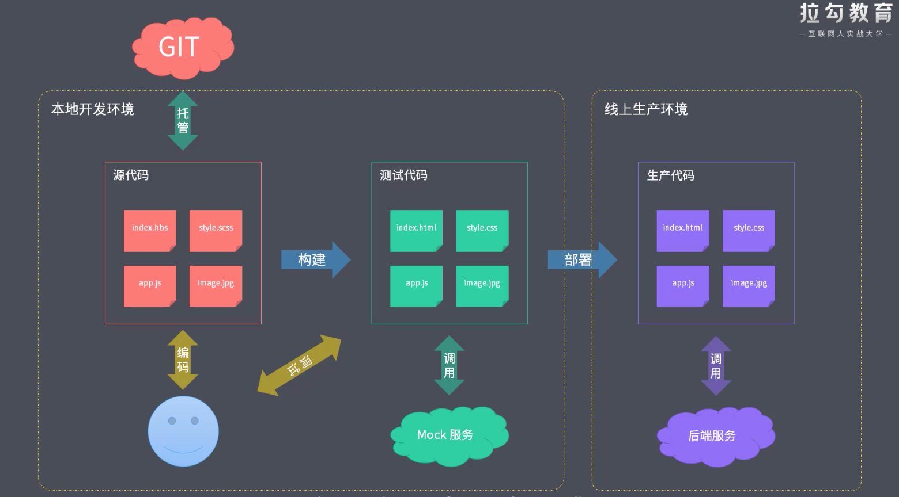

### 前端工程化
前端工程化是指遵循一定的标准和规范，通过工具去提高效率降低成本的一种手段。
近年来，前端要求不断提高，业务逻辑日益复杂。做为当下互联网时代不可或缺的技术，前端可以说是占据了整个开发行业的半壁江山，从传统的网站到现在h5、移动app、桌面应用以及小程序，前端技术几乎是无所不能的全面覆盖。在这些表象的背后，其实是前端行业对开发人员的要求发生了翻天覆地的变化。以前的套模板，调页面已经满足不了当下的开发形式了。
没有工程化之前面临的问题：
  + 使用ES6心特性，兼容有问题
  + 想要使用Less/Sass/PostCSS 增强CSS的编程性，但是运行环境不能直接支持
  + 使用模块化、组件化提高项目的可维护性，但运行环境不能直接支持
  + 部署上线前需要手动压缩代码及资源文件。部署过程需要手动上传到服务器，重复的机械式工作
  + 多人协作开发，无法硬性统一大家的代码风格。从从库中pull回来的代码质量无法保证
  + 部分功能需要等待后端服务接口提前完成
  + 整体依赖后端项目

### 工程化的表现
一切以提高效率、降低成本、质量保证为目的的手段都属于工程化

  ```flow
  st=>start: Start
  op=>operation: Your Operation
  cond=>condition: Yes or No?
  e=>end

  st->op->cond
  cond(yes)->e
  cond(no)->op
  ```

  + 创建项目
    - 使用脚手架工具创建项目结构
    - 使用脚手架工具创建特定类型文件
    - 使用脚手架工具完成基础结构的搭建
  + 编码（借助工程化的工具自动化的去完成以下事情）
    - 格式化代码
    - 校验代码风格
    - 编译/ 构建/ 打包（编译工具）
  + 预览/测试
    - Web Server (热更新) / Mock（假接口）
    - Live Reloading / HMR
    - Source Map(定位问题)
  + 提交
    - Git Hooks（自动化的在项目提交之前做项目整体的检查）项目质量，代码风格的检查  git log做限制
    - Lint-staged
    - 持续集成
  + 部署
    - CI / CD
    - 自动发布 （避免人为发布造成的一些失误）
  
###  工程化 != 某个工具
   工程化的核心是对项目整体的一种规划或者架构，工具只是帮我们实现和落地这种规划的一种手段。
   

   一些官方提供的工程化方案

   + creat-react-app
   + vue-cli
   + angular-cli
   + gatsby-cli
  
### 工程化与node.js
  Powered by Node.js
  >+ 脚手架工具开发
  >+ 自动化构建系统
  >+ 模块化打包
  >+ 项目代码规范化
  >+ 自动化部署