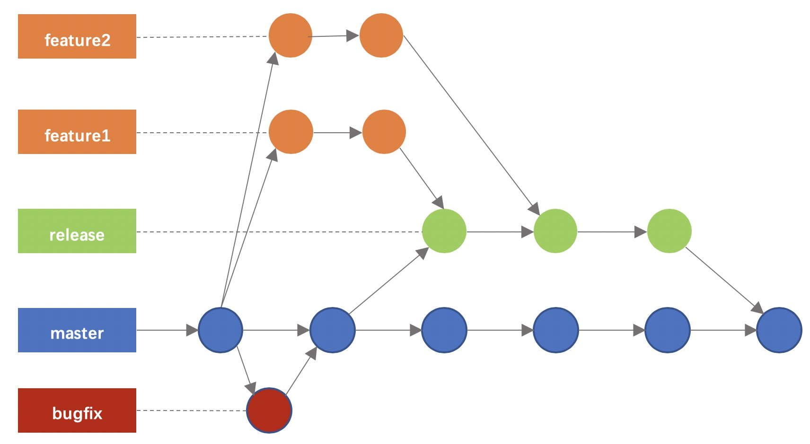

# GIT分支策略
## 分支使用场景：
**迭代发布feature**：迭代需求开发、测试、发布 
master -> feature/xxx -> release/xxx -> master

**线上问题修复bugfix**：bug修复、测试、发布
master -> bugfix/xxx -> master
测试部署 bugfix/xxx -> bugfix-qa（只是部署bugfix-qa泳道测试） 

**无法使用泳道qa**：服务无法走泳道，合入qa分支测试，测试通过后，合流到release分支并部署至qa基线进行集成测试、发布上线
master -> feature/xxx -> release/xxx -> master
测试部署 feature/xxx-> qa （只是部署用于qa基线环境测试）

+ master: 
概念：主干分支，永远是已正式上线的代码
创建：项目初始化时创建
命名：master
部署：有其他分支合入时触发自动部署qa基线环境，部署消息固定推送至“直享 - 研发”群
阶段：代码发布后由发布分支或bugfix分支合入
备注：严禁在master上直接提交代码

+ feature：
概念：开发分支/泳道分支，用于需求的开发、测试，如果多个需求在一个泳道内，则共同使用该分支
创建：任务详情的“服务列表”字段选服务之后自动创建，由master分支拉出
命名：feature/[需求的英文特性名]，如：feature/0814-order-optimize
部署：提交代码后自动部署至对应的需求泳道，部署消息推送至泳道群
阶段：开发阶段、功能测试

+ release：
概念：发布分支/合流分支，用于迭代的合流、集成测试、灰度测试、上线，
创建：迭代开始时创建，由master分支拉出
命名：release/[迭代的发布版本]，如：release/0814
部署：提交代码后自动部署至QA集成测试泳道，灰度时部署灰度泳道，发布时部署线上，部署消息推送至迭代群
阶段：集成测试、灰度、发布

+ bugfix：
概念：bugfix分支，用于紧急修复Bug，脱离迭代直接走发布流程
创建：研发创建，由master拉出
命名：bugfix/[bug英文描述]，如：bugfix/order-created-failed
部署：合入“bugfix”分支自动部署“bugfix”泳道，部署消息推送至“直享 - 研发”群
阶段：开发、测试、灰度、发布
小店端： 「https://www-qa4.qs.qq.com」- https://www-qa4.qs.qq.com  
运营端： 「https://boss-qa4.qs.qq.com」- https://boss-qa4.qs.qq.com 
服务商端：只有3个域名，联系colin手动部署（后面会增加域名）

+ qa：
概念：仅用于特殊情况需要直接部署qa基线环境
创建：需要时由研发创建，由master拉出
命名：qa
部署：提交代码后自动部署qa基线环境，部署消息推送至“直享 - 研发”群
阶段：测试、集成测试

