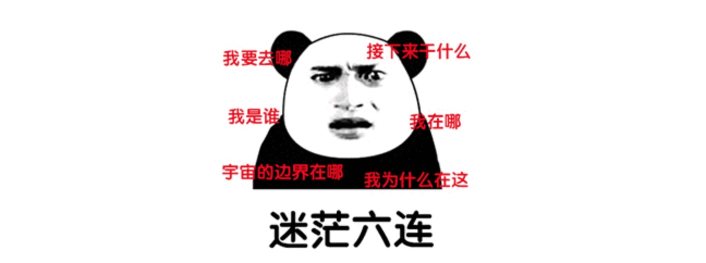

#### 

[a.x = a = {n:2}](https://www.yuque.com/docs/share/3a596a0f-a130-4fae-8898-b32e217d3789)

面试让你造火箭，上班让你拧螺丝
#### 请听题：
  > “茴香豆的『回』字有几种写法你知道么”
#### 哦，不对，请听题:
  >拧螺丝没有螺丝刀怎么办？
   怎么解释“前臂旋前 、旋后肌群力量的研究”中“顺时针拧螺丝更费力的”说法？
   扭矩跟转角法拧螺丝钉的扭矩力相差多少？
   拧下一颗被拧烂了的螺丝，使用烙铁和焊锡怎么操作才能不保证伤害螺纹？
   ……
#### 瞬间感觉自己是一个智障

#### 尼玛，我就是面试一个拧螺丝钉的，你特么问这个干嘛？
> 你觉得造人工智能的飞机有前途还是区块链的飞机有前途？
请设计一款家用飞机的外型？你觉得他跟汽车有什么区别？
你喜欢造飞机吗？你觉得女生买飞机多一点，还是男性买飞机多一点？
你如何在微博、知乎上面推广一款飞机？
……
#### 我觉得，这个问题

> 答的非常好，组织决定了，就让你加入这个项目，跟我们一起造飞机
------