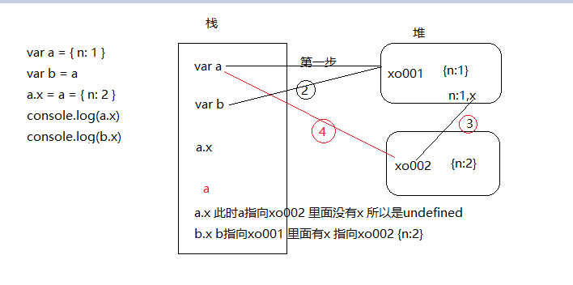
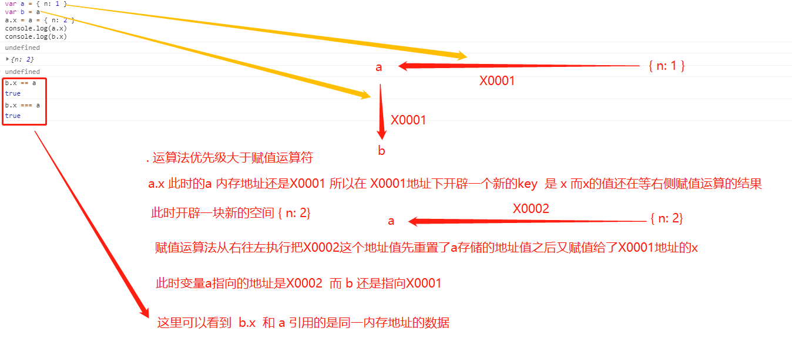

  ## 面试题 深入理解赋值表达式

  ```js
    var a = { n: 1 }
    var b = a
    a.x = a = { n: 2 }
    console.log(a.x)  // undefined
    console.log(b.x)  // { n: 2 }
  ```

  分析步骤：
  + var a = { n: 1 } 系统开了个内存空间 { n: 1 } a指过来了
  + var b = a // b也指向这个内存空间
  + a.x = a = { n: 2 }
    >+ 先看左边 a.x ,在a上开了个x 先给个undefined, 此时 a 为 { n: 1, x: undefined } b 为 { n: 1, x: undefined }
    >+ 右边的=是个运算,所以 a = { n: 2 },此时系统开辟了一个新的内存空间，此时a的指针发生改变，指向这个新的内存空间，这此时 a 为 { n: 2 }, b 为 { n: 1, x: undefined}
    >+ 此时第三行代码其实就变成了 a.x = { n: 2 }，此时的a的指针还是之前的a所指向的指针，所以此时的b就变成了 { n: 1, x: { n: 2 }}
    >+ 此时运算执行完毕，最终 a 是 { n: 2 }   b是 { n: 1, x: { n: 2 } }

  分析图
  

  

  ----------

  [网上分析链接](https://www.yuque.com/docs/share/3a596a0f-a130-4fae-8898-b32e217d3789)
