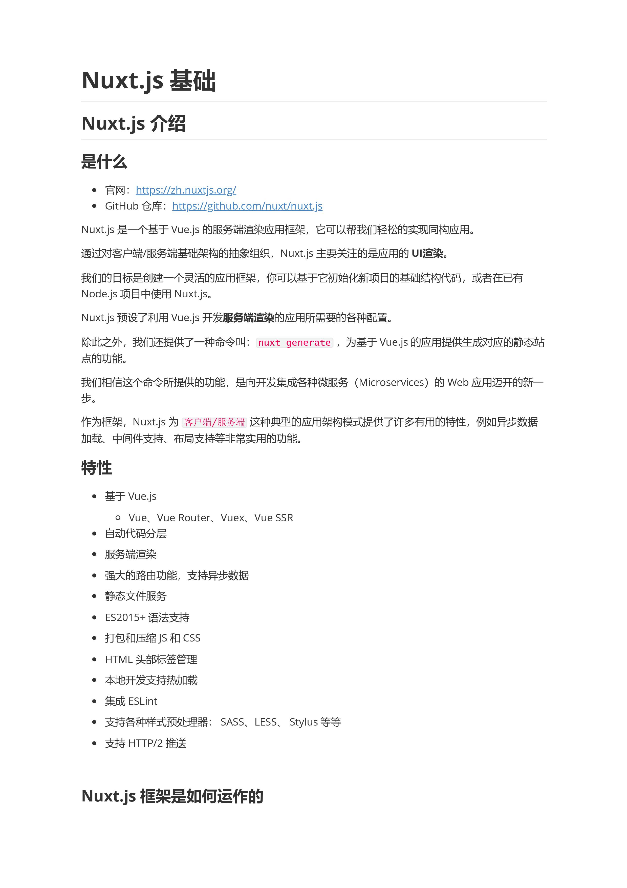
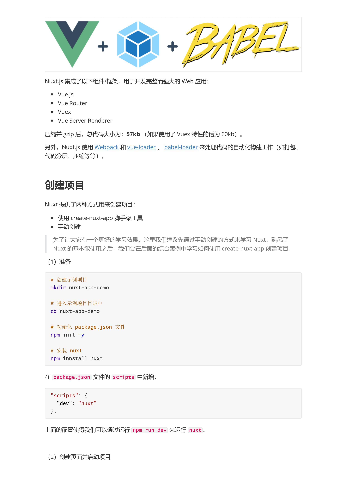
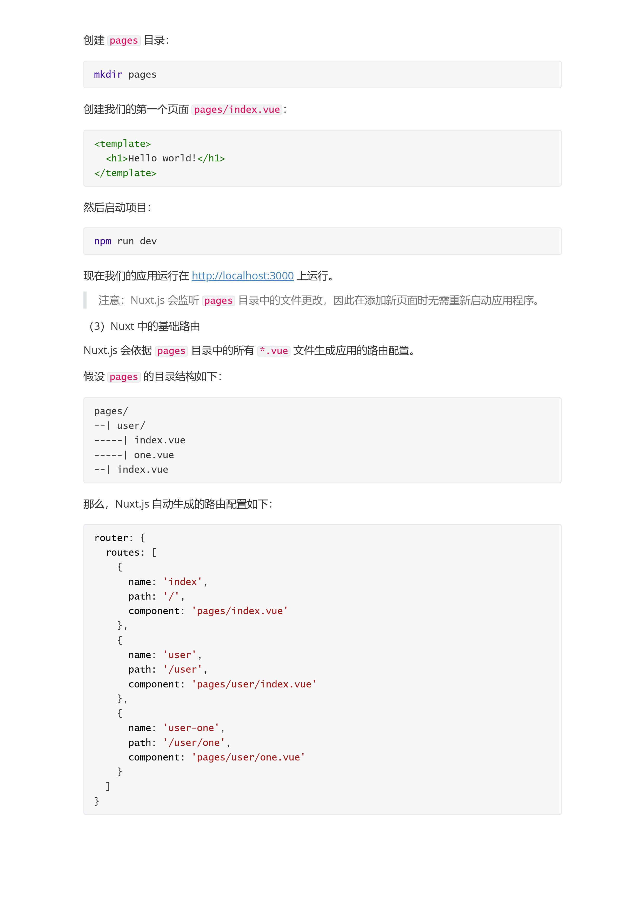
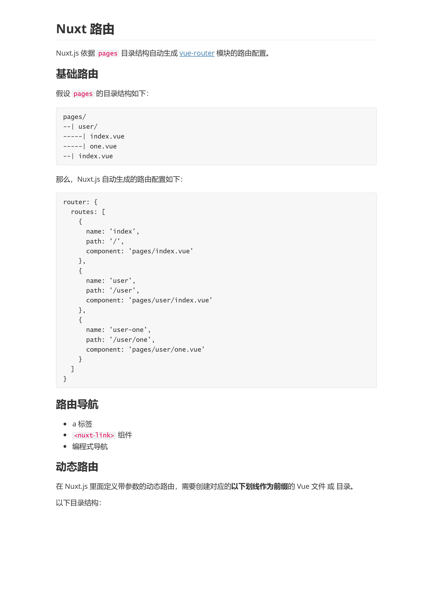
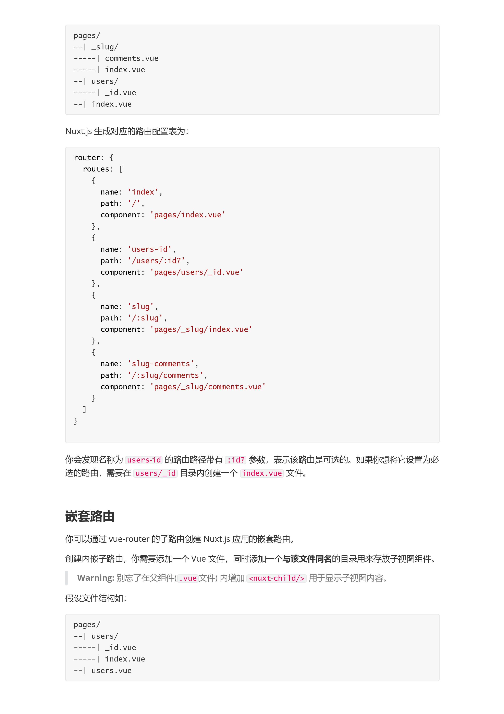

## 一 Nuxt.js是什么
+ Nuxt.js 一个基于Vue.js生态的第三方开源服务端渲染应用框架
+ 它可以帮我们轻松的使用Vue.js技术栈构建同构应用
+ [官网](https://zh.nuxtjs.org/)
+ [github仓库](https://github.com/nuxt/nuxt.js)

### 特性
+ 基于Vue.js
  + Vue、Vue Router、Vuex、Vue SSR
+ 自动代码分层
+ 服务端渲染
+ 强大的路由功能，支持异步数据
+ 静态文件服务
+ ES2015+语法支持
+ 打包和压缩JS和CSS
+ HTML头部标签管理
+ 本地开发支持热加载
+ 集成 ESLint
+ 支持各种样式预处理器： SASS、LESS、Stylus等等
+ 支持 HTTP/2 推送








## asyncData 异步数据

#### 基础用法
+ 它会将asyncData返回的数据融合组件data方法返回数据一并给组件
+ 调用时机:服务端渲染期间和客户端路由更新之前
#### 注意事项
+ 只能在页面组件中使用
+ 没有this,因为它是在组件初始化之前被调用的

#### 异步数据
Nuxt.js 扩展了 Vue.js，增加了一个叫 asyncData 的方法，使得我们可以在设置组件的数据之前能异步获取或处理数据

```javascript
    import axios from 'axios'
    export default {
      name: 'HomePage',
      async asyncData () {
        const res = await axios({
          method: 'GET',
          url: 'http://localhost:3000/data.json'
        })
        return res.data
      },
      data () {
        return {
          name: '大白菜'
        }
      }
    }

    return 中的数据 会和data中的数据合并
```

非页面组件不会调用 asyncData
我们分别在page文件新建两个文件index.vue 以及foo.vue
```html
    // index.vue
  <template>
    <div>
      <h1>Hello Nuxt.js</h1>
      <h1>{{posts[0].title}}</h1>
      <nuxt-link to="/about"></nuxt-link>
      <foo :posts="posts" />
    </div>
  </template>

<script>
import axios from 'axios'
import Foo from '@/components/Foo'
export default {
  name: 'HomePage',
  components: {
    Foo
  },
  async asyncData () {
    const res = await axios({
      method: 'GET',
      url: 'http://localhost:3000/data.json'
    })
    return res.data
  },
  data () {
    return {
      name: '大白菜'
    }
  }
}
</script>

<style>

</style>

  // foo.vue
  <template>
    <div>
      <h1>FooPage</h1>
      <ul>
        <li v-for="item in posts" :key="item.id">
          {{item.title}}
        </li>
      </ul>
    </div>
  </template>

  <script>
  export default {
    name: 'FooPage',
    props: ['posts']
  }
  </script>

  <style>

  </style>
```

### nuxt案例介绍
+ 案例名称： RealWorld
+ 一个开源的学习项目，目的就是帮助开发者快速学习新技能