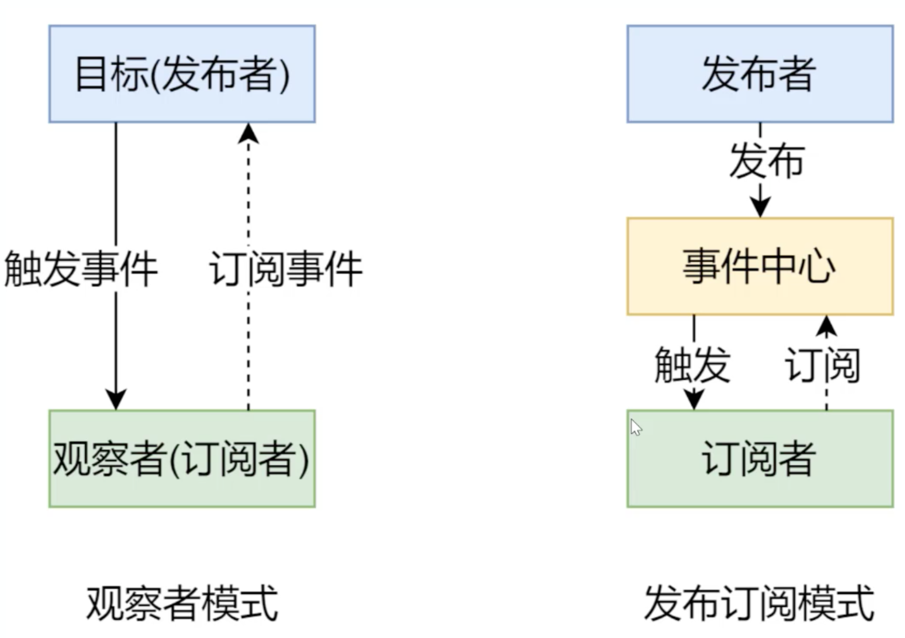
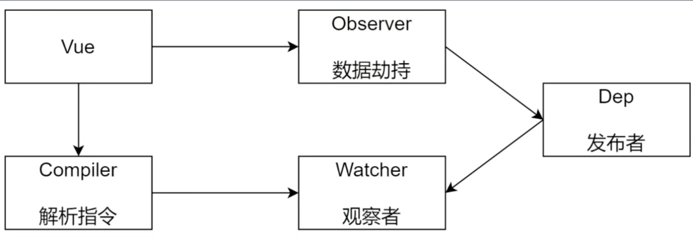

# vue 基础
## [官方文档](https://cn.vuejs.org/v2/guide/)


### 基础结构
```js
  // vue内部会将data中的数据填充倒el指向的模板中，并把模板渲染到浏览器
  new Vue({
    el: '#app',     
    data: {
      company: {
        name: 'bootstet'
      }
    }
  })
  // 另一种结构

  new Vue({
    data: {
      company: {
        name: 'bootstet'
      }
    },
    render(h) {         // h函数创建虚拟dom，render返回h函数创建的虚拟函数
      return h('div', [
        h('p', '姓名' + this.company.name)
      ])
    }
  }).$mount('#app')   // $mount 方法是把虚拟dom转换为真实dom渲染到浏览器

```

#### vue声明周期
+ created 在一个实例被创建之后执行代码
+ mounted 实例被挂载后调用
+ updated 数据更改调用
+ destroyed 实例销毁后调用，所有的指令都被解绑，所有的事件监听器被移除，所有的子实例被销毁


#### 语法和基础概念  v-为前缀
  + 插值表达式  {{}}
  + v-html
  + v-once 一次性插值 
  + v-bind 响应式的更新 attribute    缩写为 :
  + v-for
  + v-on 监听dom事件                缩写为 @
  + v-model 表单输入与应用状态之间的双向绑定

#### 计算属性和侦听器
  + 基于相应式依赖进行缓存 computed
  + 方法 methods 每次都会更新
  + 侦听属性  每当数据放生改变，这个函数就会运行
    ```js
      watch: {
        question: function (newQuestion, oldQuestion) {
          this.answer = 'wait'
        }
      }
    ```

#### Class和Style绑定
+ 对象语法
  ```js
    <div v-bund:class = "{ active: isActive }"></div>
  ```


#### 条件渲染/列表渲染
+ v-if false 不会输出元素
+ v-show 元素会渲染到页面，通过样式控制其隐藏或者显示
+ v-for  key
  
#### 组件

#### 插槽

#### 插件
+ vue-router
+ vuex

#### 混入 mixin

#### 深入响应式原理

#### 不同构建版本的Vue

## vue-router
### 编程时导航
  + replace 不会记录历史
  + push会记录历史
    ```js
      this.$router.push({ name: 'Index' })
      this.$router.replace('/login')  // 本次跳转不记录历史
      this.$router.go(-2)   // 跳回上一个页面

    ```
### hash 和 history模式区别
> 客户端路由实现方式，当路径发生变化时，不会发生服务端请求，用js监视路由的变化，根据不同的地址渲染不同的内容 
+ hash模式
  ```js
   https://music.163.com/#/playlist?id=3102961863 // 很丑

  ```
  基于锚点，以及onhashchange事件，当地址发生变化，触发onhashchange，根据路径呈现页面的内容
+ history模式
  ```js
   https://music.163.com/playlist?id=3102961863 // 正常的url，需要服务端配置支持
  基于html5的history Api
  + history.pushState()  IE 10 以后支持
    history.push 路径发生变化，想服务器发生请求 与
    history.pushState不会向服务端发生请求，代表浏览器里的地址，并把地址记录到历史记录中
  + history.replaceState()
  ```
+ history 需要服务端支持 
  - 单页应用中，服务端不存在http://www.testurl.com/login这样的地址会返回到不到该页面
  - 在服务端应该出了静态资源外都返回单页应用的index.html
  - 在history模式下，刷新页面以后浏览器向服务端请求页面，服务端不存在此页面后会返回配置的默认index.html文件，浏览器在拿到index.html根据浏览器的路径在解析渲染相应的内容。
+ node导出模块的方式 commonJS方式

## vue响应式原理模拟
### 数据驱动
+ 数据响应式
  + 数据模型仅仅是普通的Javascript对象，而当我们修改数据时，视图会进行更新，避免了繁琐的DOM操作，提高开发效率
  

+ 双向绑定
  + 数据改变，视图改变；视图改变，数据也随之改变
  + 试用v-model在表单元素上创建双向数据绑定

+ 数据驱动是Vue最独特的特征之一
  + 开发过程中仅需要关注数据本身，不需要关心数据是如何渲染到视图

### 响应式核心原理
+ Vue 2.x [MDN - Object.defineProperty](https://developer.mozilla.org/zh-CN/docs/Web/JavaScript/Reference/Global_Objects/Object/defineProperty)
  + 单属性
  ```js
    // 模拟Vue中的 data 选项
    let data = {
      msg: 'hello',
      count: 10

    }

    // 模拟Vue的实例
    let vm = {}

    // 数据劫持： 当访问或者设置 vm 中的成员的时候，做一些干预操作
    Object.defineProperty(vm, 'msg', {
      // 可枚举
      enumerable: true,
      // 可配置（可以使用 delete 删除， 可以通过 defineProperty 重新定义）
      configurable: true,
      // 当获取值的时候执行
      get () {
        console.log('get:', data.msg)
        return data.msg
      },
      // 当设置值的时候执行
      set (newValue) {
        console.log('set:', newValue)
        if (newValue === data.msg) {
          return
        }
        data.msg = newValue
        // 数据更新，更新 DOM 的值
        document.querySelector('#app').textContent = data.msg
      }
    })
    
    // 测试
    vm.msg = 'Hello World'
    console.log(vm.msg)

  ```
  + 多属性
    ```js
      // 模拟Vue中的 data 选项
    let data = {
      msg: 'hello',
      count: 10

    }

    // 模拟Vue的实例
    let vm = {}

    proxyData(data)

    function proxyData(data) {
      // 遍历 data 对象的所有属性
      Object.keys(data).forEach(key => {
        // 把 data 中的属性， 转换为 vm 的 setter/getter
        Object.defineProperty(vm, key, {
          enumerable: true,
          configurable: true,
          get () {
            console.log('get: ', key, data[key])
            return data[key]
          },
          set (newValue) {
            console.log('set: ', key, newValue)
            if (newValue === data[key]) {
              return
            }
            data[key] = newValue
            // 数据更改，更新 DOM 的值
            document.querySelector('#app').textContent = data[key]
          }
        })
      })
    }
    
    // 测试
    vm.msg = 'Hello World'
    console.log(vm.msg)

    ```
+ vue 3.x 
  + [MDN - Proxy](https://developer.mozilla.org/zh-CN/docs/Web/JavaScript/Reference/Global_Objects/Proxy)
  + 直接监听属性，而非属性
  + ES6中新增，ie不支持，性能有浏览器优化
  ```js
   // 模拟 Vue 中的 data 选项
    let data = {
      msg: 'hello',
      count: 0
    }

    // 模拟 Vue 实例
    let vm = new Proxy(data, {
      // 执行代理行为的函数
      // 当访问 vm 的成员会执行
      get (target, key) {
        console.log('get, key: ', key, target[key])
        return target[key]
      },
      // 当设置 vm 的成员会执行
      set (target, key, newValue) {
        console.log('set, key: ', key, newValue)
        if (target[key] === newValue) {
          return
        }
        target[key] = newValue
        document.querySelector('#app').textContent = target[key]
      }
    })

    // 测试
    vm.msg = 'Hello World'
    console.log(vm.msg)
  ```

### 发布订阅模式和观察者模式
+ 发布/订阅模式
  + 订阅者
  + 发布者
  + 信息中心
+ Vue的自定义事件
```js
  let vm = new Vue()

  vm.$on('dataChange', () => {
    console.log('dataChange')
  })

  vm.$on('dataChange', () => {
    console.log('dataChange1')
  })

  vm.$emit('dataChange')

```

+ 兄弟间组件通信过程
  ```js
    // enentBud.js
    // 事件中心
    let enentHub = new Vue()

    // ComponentA.vue
    // 发布者
    addTodo: function () {
      // 发布消息（事件）
      evnetHub.$emit('add-todo', { text: this.newTodoText })
      this.newTodoText = ''
    }

    // ComponentB.vue
    // 订阅者
    created: function () {
      // 订阅消息（事件）
      enentHub.$on('add-todo', this.addTodo)
    }
  ```

+ 模拟 Vue 自定义事件的实现
  ```js

    // 事件触发器
    class EvnetEmitter {
      constructor() {
        // { 'click': [fn1, fn2] }
        this.subs = Object.creat(null)  // 对象的原型为null
      }
      // 注册事件
      $on (evnetType, handler) {
        this.subs[eventType] = this.subs[eventType] || []
        this.subs[eventType].push(handler)
      }
      // 触发事件
      $emit (eventType) {
        if (this.subs[eventType]) {
          this.subs[eventType].forEach(handler => {
            handler()
          })
        }
      }
    }

    // 测试
    let em = new EventEmitter()
    em.$on('click', () => {
      console.log('click1')
    })
    em.$on('click', () => {
      console.log('click2')
    })
    em.$emit()
    
  ```
### 观察者模式
  + 观察者（订阅者）-- Watcher
    + update(): 当事件发生时，具体要做的事情
  + 目标（发布者）-- Dep
    + subs 数组： 存储所有的观察者
    + addSubs(): 添加观察者
    + notify(): 当事件发生，调用所有观察者的Update()方法
  + 没有事件中心
  ```js
    // 发布者 - 目标 
    // Dependency
    class Dep {
      constructor () {
        // 存储所有的观察者
        this.subs = []
      }
      // 添加观察者
      addSub (sub) {
        if (sub && sub.update) {
          this.subs.push(sub)
        }
      }
      // 通知所有观察者
      notify () {
        this.subs.forEach(sub => {
          sub.update()
        })
      }
    }

    // 订阅者 - 观察者 
    class Watcher {
      update () {
        console.log('update' )
      }
    }

    // 测试
    let dep = new Dep()
    let watcher = new Watcher()

    dep.addSub(watcher)

    dep.notify()
  ```
### 总结
+ **观察者模式**是由具体目标调度，比如当事件触发，Dep 就会去调用观察者的方法，所以观察者模式的订阅者与发布者之间是存在依赖的
+ **发布/订阅模式**有统一中心调用，因此发布者和订阅者不需要知道对方的存在
  
  

## Vue响应式原理模拟

### 整体分析
+ Vue基本结构
+ 打印Vue实例观察
+ 整体结构
  

+ Vue
  + 把data中的成员注入到Vue实例，并且把data中的成员转成 getter/setter
+ Observer（观察者）
  + 能够吧数据队形的所有属性进行监听，如有变动可拿到最新值并通知Dep
+ Compiler（编译）
  + 解析每个元素中的指令/插值表达式，并替换成相应的数据
+ Dep
  + 添加观察者（Watcher），当数据变化通知所有观察者
  
### Vue
 
 + 功能
   + 负责接受初始化的参数（选项）
   + 负责吧data中的属性注入到Vue实例，转换成getter/setter
   + 负责调用 observer 监听 data 中的所有属性的变化
   + 负责调用 compiler 解析指令/插值表达式

### Observer
  + 功能
    + 负责吧data选项中的属性转换为响应式数据
    + data中的某个属性也是对象，把改属性转换成响应式数据
    + 数据变化发送通知
  
### Compiler
  + 功能
    + 负责编译模板，解析指令/差值表达式
    + 负责页面的首次渲染
    + 当数据变化后重新渲染师徒

### Watcher
  + 功能
    + 当数据变化触发依赖，dep通知所有的Watcher实例更新视图